# ePROJECT (PROJECT 3) FINAL REPORT
## HIGHER DIPLOMA IN SOFTWARE ENGINEERING (HDSE)
### FPT APTECH COMPUTER EDUCATION

---

<br><br>

<div align="center">

# APTECHMART
## MULTI BRANCH ONLINE SUPERMARKET SYSTEM

<br>

**Technology Stack:**  
**.NET 10 (ASP.NET Core Minimal APIs) • Entity Framework Core 10**  
**MySQL 8.4 LTS • React 19 (TypeScript + Vite 7) • Docker Compose**

<br><br>

| Project Information | Specification Details |
| :--- | :--- |
| **Academic Institution:** | FPT Aptech Computer Education |
| **Curriculum Semester:** | Semester III (eProject 3 / Project 3) |
| **Academic Batch / Class:** | C2209L / CP2026 |
| **Academic Mentor / Faculty:** | Academic Mentor & Project Faculty, Aptech Computer Education |
| **Implementation Period:** | June 2026 – September 2026 |
| **Final Submission Date:** | September 2026 |

<br>

### PROJECT DEVELOPMENT TEAM MEMBERS

| No. | Student Full Name | Student ID | Primary Role | Assigned Subsystems & Responsibilities |
| :---: | :--- | :---: | :--- | :--- |
| 1 | **MINH NGUYEN QUANG** | **Student1328327** | **Team Leader / Backend Lead** | System Architecture, Global Catalog, Multi-Branch Inventory, Branch Carts (FR-101, 102, 103, 107, 203) |
| 2 | **DUNG PHAM HUU** | **Student1520086** | **Security & Identity Specialist** | PBKDF2 Password Hashing, JWT Authentication, Refresh Token Rotation, Profile, Address Book, RBAC (FR-105, 106, 114, 115, 206) |
| 3 | **MANH MAI TIEN** | **Student1226001** | **Transaction & Payment Engineer** | ACID Transactional Stock Reservation, Order Lifecycle, Multi-Gateway Payments COD/VNPay/MoMo, IPN Idempotency (FR-108, 109, 110, 112, 205) |
| 4 | **LUONG NGUYEN DUC** | **Student1242500** | **Frontend Lead & QA Engineer** | Storefront Client, Admin Portal UI/UX, Product Comparison, Verified Reviews, QA Test Automation (FR-104, 111, 113, 201, 202, Cycle 5) |

<br><br>

*Hanoi, September 2026*

</div>

<div style="page-break-after: always;"></div>

---

# TABLE OF CONTENTS

- **ACKNOWLEDGEMENTS**
- **CHAPTER 1: ePROJECT SYNOPSIS**
  - 1.1. Project Title & Real-World Context
  - 1.2. Project Objectives (Business & Technical)
  - 1.3. System User Roles (Actors)
  - 1.4. Project Scope & Scope Management (24 FRs & 5 Scope Drifts)
  - 1.5. Technology Stack Summary
- **CHAPTER 2: ePROJECT ANALYSIS**
  - 2.1. System Requirements Analysis & Business Workflow
  - 2.2. Functional Requirements Specification (Canonical 24 FRs)
  - 2.3. Non-Functional Requirements (NFRs)
  - 2.4. Role-Based Access Control (RBAC) Matrix
- **CHAPTER 3: ePROJECT DESIGN**
  - 3.1. System Architecture Design
  - 3.2. Data Flow Diagrams (Context & Level 0 DFDs)
  - 3.3. Business Process Flowcharts & State Machines
    - Authentication & Token Rotation Flowchart
    - Transactional Checkout & Stock Reservation Flowchart
    - Order Lifecycle State Machine
    - Payment Webhook IPN Idempotency Flowchart
  - 3.4. Database Design
    - Entity-Relationship Diagram (ERD - 23 Tables)
    - Comprehensive Data Dictionary (All 23 Canonical Tables)
- **CHAPTER 4: SYSTEM SCREENSHOTS & UI WALKTHROUGH**
  - 4.1. Customer Storefront Interface (Figures 4.1 to 4.10)
  - 4.2. Administrator Management Portal (Figures 4.11 to 4.16)
- **CHAPTER 5: CORE SOURCE CODE WITH COMMENTS**
  - 5.1. Domain Tier: Inventory Invariants & Atomic Stock Reservation (`BranchInventory.cs`)
  - 5.2. Security & Identity: PBKDF2 Password Hashing (`PasswordHasher.cs`)
  - 5.3. Application Tier: Transactional Checkout (`CheckoutEndpoints.cs`)
  - 5.4. Infrastructure Tier: Idempotent Payment Callbacks (`PaymentCallbackProcessor.cs`)
  - 5.5. Infrastructure Tier: Secret Redaction & Log Sanitization (`JobErrorSanitizer.cs`)
  - 5.6. Presentation Tier: Branch Context State Management (`BranchContext.tsx`)
- **CHAPTER 6: USER GUIDE**
  - Part A: Customer Operational Guide (Numbered Procedures 1 to 7)
  - Part B: Administrator Operational Guide (Numbered Procedures 1 to 7)
- **CHAPTER 7: DEVELOPER'S GUIDE**
  - 7.1. Development Prerequisites & Environment Versions
  - 7.2. Solution Directory Structure & Architectural Responsibilities
  - 7.3. Environment Configuration (`.env.example`)
  - 7.4. Database Setup, Migrations & Automated Data Seeding
  - 7.5. Running the Application (Docker Compose & Native)
  - 7.6. Build & Automated Test Execution
  - 7.7. Common Troubleshooting & Solutions
- **CHAPTER 8: REFERENCES & BIBLIOGRAPHY**
- **APPENDIX A: FR VERIFICATION CHECKLIST** (See CHAPTER_SUPPLEMENTS.md)
- **APPENDIX B: TEST EXECUTION RESULTS** (See CHAPTER_SUPPLEMENTS.md)
- **APPENDIX C: SCREENSHOT CAPTURE GUIDE** (See CHAPTER_SUPPLEMENTS.md)
- **APPENDIX D: DIAGRAM CONVERSION GUIDE** (See CHAPTER_SUPPLEMENTS.md)
- **APPENDIX E: DELIVERABLES CHECKLIST** (See CHAPTER_SUPPLEMENTS.md)

---

# SUPPLEMENTARY APPENDICES (See Separate Document)

> **Note**: The following supplementary materials are provided in the companion document `CHAPTER_SUPPLEMENTS.md`:
>
> - **Appendix A**: Functional Requirements Verification Checklist (24 FRs mapped to implementation & tests)
> - **Appendix B**: Automated Test Execution Results (146 tests with full coverage report)
> - **Appendix C**: Screenshot Capture Guide for Chapter 4
> - **Appendix D**: Mermaid Diagram Conversion Instructions
> - **Appendix E**: Project Deliverables Checklist

<div style="page-break-after: always;"></div>

---

<div style='page-break-after: always;'></div>

---

# ACKNOWLEDGEMENTS

The authoring team of the **AptechMart Multi Branch Online Supermarket System** would like to express our deepest gratitude and sincere appreciation to the individuals and organizations whose guidance, support, and dedication made the completion of this eProject (Project 3) possible:

1. **Board of Directors and Academic Department of FPT Aptech Computer Education**:
   For providing a world-class, professional, and inspiring learning environment. The comprehensive curriculum has equipped us with advanced software engineering principles, industry best practices, and modern technology competencies including ASP.NET Core, React, Entity Framework Core, distributed transaction management, and containerization.

2. **Project Supervisor and Faculty Mentors**:
   We extend our heartfelt thanks to our Academic Mentor and Project Faculty for their invaluable time, continuous encouragement, and insightful technical guidance throughout the project lifecycle. Their rigorous reviews, architectural critiques on Clean Architecture, database normalization, concurrency management, and API security have served as our guiding compass in delivering a robust and production-grade software solution.

3. **Members of the Project Examination Committee (Defense Panel)**:
   We express our sincere thanks to the Examination Committee for their dedicated time in reviewing our codebase, validating system functionalities, and posing constructive and thought-provoking defense questions that bridge academic theory with enterprise realities.

4. **Project Team Members**:
   Special thanks go to the disciplined teamwork, mutual trust, and high commitment demonstrated by all four members throughout the intensive design, implementation, and verification phases:
   - **Student1328327 - MINH NGUYEN QUANG (Team Leader & Backend Lead)**: Guided system architecture, orchestrated database migrations, developed the Global Catalog, Multi-Branch physical inventory model, and branch-aware Shopping Cart subsystems.
   - **Student1520086 - DUNG PHAM HUU (Security & Identity Specialist)**: Designed and implemented enterprise-grade security invariants, PBKDF2 salted password hashing, JWT Bearer authentication, Refresh Token Rotation, user profiles, and Role-Based Access Control (RBAC).
   - **Student1226001 - MANH MAI TIEN (Transaction & Payment Engineer)**: Architected the ACID transactional stock reservation engine, integrated multi-gateway sandbox payment processing (COD, VNPay, MoMo), and engineered idempotent webhook callback verification.
   - **Student1242500 - LUONG NGUYEN DUC (Frontend Lead & QA Engineer)**: Engineered the responsive React 19 storefront client and Admin Portal, crafted intuitive UI/UX workflows, authored comprehensive technical documentation, and executed automated test suites.

While we have invested our utmost effort and dedication to achieve perfection, minor limitations may still exist. We respectfully welcome all constructive feedback and recommendations from the Examination Committee to further enhance our solution.

*Hanoi, September 2026*  
**Project Development Team - AptechMart**

<div style='page-break-after: always;'></div>

---

# CHAPTER 1: ePROJECT SYNOPSIS

## 1.1. Project Title & Real-World Context

- **Project Title**: **AptechMart Multi Branch Online Supermarket System**
- **Academic Domain**: Project 3 (eProject) — Higher Diploma in Software Engineering (HDSE)
- **Institution**: FPT Aptech Computer Education

### Real-World Business Context
In the contemporary retail and digital commerce landscape, omnichannel grocery and supermarket chains operate complex networks of physical retail branches distributed across diverse districts and metropolitan regions. Traditional single-warehouse e-commerce platforms suffer from acute structural limitations when applied to supermarket chains:
1. **Inventory Location Mismatch (Overselling & Logistics Lag)**: In a single-inventory pool architecture, an online shopper in District A may order items that are physically out of stock in the branch nearest to them. Fulfilling the order requires cross-docking or shipping from a distant warehouse, resulting in high logistics costs, long delivery delays, and spoilage of perishable goods.
2. **Pricing Disparity Across Branches**: Operational expenditures, commercial rent, and regional supplier agreements vary across physical locations. A supermarket branch situated in a central metropolitan shopping district may have different operating overheads and promotional pricing than a suburban branch. Legacy platforms lack the capability to maintain branch-specific selling prices on a unified product catalog.
3. **Lack of Seamless Omnichannel Customer Choice**: Customers increasingly expect flexible fulfillment options: selecting between **Store Pickup** (reserving goods at a chosen supermarket branch and collecting them in person) and **Home Delivery** (expedited shipping from the closest neighborhood branch). Without branch-aware inventory, customers cannot ascertain whether their local store possesses the desired goods.

### The AptechMart Solution
**AptechMart** is designed from the ground up to overcome these challenges through an enterprise-grade **Multi-Branch Inventory & Pricing Architecture**:
- **Global Catalog Foundation**: A standardized, unified product hierarchy (`categories`, `brands`, `products`, `SKU`) is maintained centrally.
- **Distributed Branch Inventory**: Each physical supermarket branch (`branches`) maintains independent inventory ledgers (`branch_inventories`) with isolated selling prices (`selling_price`), on-hand stock (`quantity_on_hand`), reserved allocations (`reserved_quantity`), available stock (`available_quantity = quantity_on_hand - reserved_quantity`), and reorder thresholds (`reorder_level`).
- **Branch-Aware Cart & Atomic Stock Reservation**: A customer's shopping cart (`carts`) is bound to their selected physical supermarket branch. During checkout, an atomic database transaction verifies stock availability and places an immediate reservation lock (`reserved_quantity`), completely preventing race conditions and overselling.

---

## 1.2. Project Objectives

### Business & Operational Objectives
1. **End-to-End Retail Journey**: Provide a frictionless digital shopping experience spanning localized product browsing, category filtering, branch selection, side-by-side product comparison, branch-aware carts, transactional checkout, multi-gateway payments, and order tracking.
2. **Multi-Gateway Payment Integration**: Provide diverse, secure payment options including Cash on Delivery (COD), VNPay Sandbox, and MoMo Sandbox with tamper-proof HMAC-SHA512 signature verification and idempotent IPN callback processing.
3. **Comprehensive Admin Portal**: Empower supermarket store managers and corporate administrators with tools to manage multi-tier category trees, brand portfolios, product catalogs, branch pricing and stock levels, order status lifecycle workflows, and customer accounts.

### Technical & Architectural Objectives
1. **Clean Architecture & Domain-Driven Design**: Strict layer separation across Domain, Application, Infrastructure, and Presentation tiers to maximize maintainability, testability, and enterprise extensibility.
2. **Strict Concurrency & Data Integrity**: Leverage database transaction scopes, row-level locks, and native check constraints to guarantee that `available_quantity` and `quantity_on_hand` never drop below zero, even under heavy concurrent load.
3. **Modern Identity & Token Security**: Implement stateless JSON Web Token (JWT) Bearer authentication coupled with **Refresh Token Rotation (RTR)** to ensure high security and mitigate replay/theft attacks.
4. **Automated Verification**: Complete automated testing covering Domain Unit Tests, Infrastructure Integration Tests, Minimal API Endpoint Tests, and Frontend Vitest suites.
5. **Containerized Deployment**: Single-command orchestrations via Docker Compose ensuring identical staging, evaluation, and production environments.

---

## 1.3. System User Roles (Actors)

| Actor | Description & System Permissions |
| :--- | :--- |
| **Guest (Unauthenticated Visitor)** | Can browse public product catalogs, search keywords, filter by category/brand/price range, view product technical specifications, switch active supermarket branches to inspect localized stock availability and prices, and compare specifications between 2–4 products. |
| **Customer (Registered Member)** | Possesses all Guest privileges plus authenticated capabilities: manage profile details, maintain a multi-point shipping address book with a transactional default address, create and maintain branch-specific shopping carts, execute checkout, select delivery vs. pickup, pay via sandbox gateways, monitor order history, and submit verified product reviews on fulfilled orders. |
| **Administrator (System Admin / Manager)** | Corporate and operational personnel. Full administrative privileges: create/update/soft-delete multi-tier categories and brands, manage products and SKU identifiers, adjust localized prices and replenish stock per branch, advance order state machines, ban/unban user accounts, trigger batch analytics jobs, and inspect sales and demand forecast reports. |

---

## 1.4. Project Scope & Scope Management

### Core Functional Scope (24 Canonical Functional Requirements)
The system delivers 24 canonical functional requirements divided across two primary portals:
- **Customer Portal**: FR-101 to FR-115 (Browse, Branch Selection, Detail View, Comparison, Profile, Addresses, Cart, Checkout, Delivery Selection, Sandbox Payments, Coupons, Order History, Reviews, Registration, Authentication).
- **Admin Portal**: FR-201 to FR-209 (Category/Brand CRUD, Product/SKU CRUD, Branch Inventory & Price Management, Promotions CRUD, Order Management, User Account Controls, Sales Reporting, Demand Forecast Alerts, Recommendation Intelligence).

### Scope Drift Management
To ensure that development efforts remained strictly focused on core transactional integrity and system reliability, non-essential secondary features were formally classified and controlled:
- `SD-001 (Wishlist / Favorites)`: Classified as **Deferred** — prioritized core branch-aware cart and transactional reservation.
- `SD-002 (Comparison beyond 4 products)`: Classified as **Out of Scope** — constrained comparison to 2–4 items to maintain optimal mobile responsiveness.
- `SD-003 (Real-time Shipper GPS Tracking)`: Classified as **Out of Scope** — order fulfillment is modeled through standard delivery milestone status transitions.
- `SD-004 (Installation & Warranty Management)`: Classified as **Out of Scope** — retail appliances are covered under standard manufacturer documentation.
- `SD-005 (Guest Checkout without Account)`: Classified as **Deferred** — mandatory account registration enforces customer ownership and verified order history.

---

## 1.5. Technology Stack Summary

```text
┌──────────────────────────────────────────────────────────────────────────────────┐
│                             PRESENTATION TIER                                    │
│   React 19 • TypeScript • Vite 7 • Tailwind CSS / Modern Vanilla CSS • Lucide UI │
└────────────────────────────────────────┬─────────────────────────────────────────┘
                                         │ RESTful HTTP / JSON (Axios, OpenAPI 3.1)
┌────────────────────────────────────────▼─────────────────────────────────────────┐
│                             APPLICATION & API TIER                               │
│        ASP.NET Core Minimal APIs (.NET 10) • JWT Bearer Authentication           │
│        Clean Architecture • FluentValidation • MediatR / Service Handlers        │
└────────────────────────────────────────┬─────────────────────────────────────────┘
                                         │ Repository & Unit of Work / Invariants
┌────────────────────────────────────────▼─────────────────────────────────────────┐
│                           DOMAIN & PERSISTENCE TIER                              │
│       Entity Framework Core 10 • Pomelo / MySqlConnector • Transaction Scopes    │
│       MySQL 8.4 LTS (23 Relational Tables, Snake_case, UUID v7, Check Invariants)│
└──────────────────────────────────────────────────────────────────────────────────┘
```

<div style='page-break-after: always;'></div>

---

# CHAPTER 2: ePROJECT ANALYSIS

## 2.1. System Requirements Analysis & Business Workflow

### Multi-Branch Retail Operations Survey
In an enterprise online supermarket network, each physical branch acts as a localized fulfillment node serving a specific geographic radius. The core operational challenge lies in coordinating localized inventory, branch-specific pricing, and centralized customer account management.

```text
[Customer Accesses Site]
          │
          ▼
[Select Nearest Branch] ────────► [Inspect Localized Catalog & Prices]
          │                                      │
          ▼                                      ▼
[Build Branch-Specific Cart] ───► [Transactional Stock Reservation (ACID)]
          │                                      │
          ▼                                      ▼
[Choose Delivery / Pickup] ─────► [Execute Sandbox Payment (COD/VNPay/MoMo)]
          │                                      │
          ▼                                      ▼
[Order Status: Processing] ─────► [Store Fulfills & Delivers Goods]
          │                                      │
          ▼                                      ▼
[Order Status: Completed]  ─────► [Customer Submits Verified Review]
```

---

## 2.2. Functional Requirements Specification (Canonical 24 FRs)

Each functional requirement implemented and verified in the submission package is documented below with formal behavioral specifications:

---

### FR-101: Product Catalog & Multi-Facet Filtering
- **Description**: Allows customers and visitors to browse products, search by keyword, and filter by category, brand, and price range.
- **Actor**: Guest, Customer
- **Preconditions**: Products exist in the catalog and branches are initialized.
- **Main Flow**:
  1. User navigates to `/products`.
  2. System queries active products from database.
  3. User specifies a search keyword or selects category/brand/price filters.
  4. User chooses sorting order (price ascending, descending, or newest).
  5. System returns matching products with paginated metadata.
- **Alternative Flow**:
  - *No matching products found*: System displays a user-friendly "No products found matching your search" message with a reset filter button.
- **Expected Result**: Filtered product list displayed with thumbnail, name, brand, localized price, and stock status.
- **API Endpoint**: `GET /api/products`

---

### FR-102: Physical Supermarket Branch Selection
- **Description**: Enables users to switch between physical supermarket branches, instantly updating localized pricing and stock availability across the entire catalog.
- **Actor**: Guest, Customer
- **Preconditions**: At least one active physical branch exists in the database.
- **Main Flow**:
  1. User clicks the Branch Selector on the navigation header.
  2. System presents dropdown of active branches (e.g. Cau Giay, Dong Da, Ha Dong).
  3. User selects a target branch.
  4. System updates active branch context in client state and storage.
  5. System re-queries catalog endpoints with `branchId` parameter.
- **Alternative Flow**:
  - *Branch has pending cart with items*: System alerts the user that cart contents belong to the previous branch and provides options to clear or keep the previous cart.
- **Expected Result**: Catalog immediately displays localized unit prices and real-time available stock for the newly selected store.
- **API Endpoint**: `GET /api/branches`

---

### FR-103: Product Specification Detail View
- **Description**: Displays full technical specifications, high-resolution photo gallery, detailed descriptions, and localized stock status for a selected product.
- **Actor**: Guest, Customer
- **Preconditions**: Product exists in the catalog.
- **Main Flow**:
  1. User selects a product card.
  2. System loads product details, specifications table, image gallery, and branch inventory.
  3. System renders available stock quantity for the currently active branch.
- **Alternative Flow**:
  - *Product not found or inactive*: System returns `404 Not Found` with redirect to `/products`.
- **Expected Result**: Complete product presentation with quantity selector, stock indicator, and specifications.
- **API Endpoint**: `GET /api/products/:id`

---

### FR-104: Side-by-Side Product Comparison
- **Description**: Allows users to select 2 to 4 products within the same category to compare technical specifications and localized prices side by side.
- **Actor**: Guest, Customer
- **Preconditions**: Products must belong to the same category.
- **Main Flow**:
  1. User clicks the "Compare" icon on a product.
  2. System adds the product to client comparison state.
  3. User selects a second product in the same category.
  4. System renders comparison modal overlay with aligned technical attribute rows.
- **Alternative Flow**:
  - *User attempts to compare items from different categories*: System displays validation warning: "Comparison is only supported for products in the same category."
  - *User attempts to compare > 4 items*: System alerts that the 4-item comparison ceiling has been reached.
- **Expected Result**: Clean side-by-side comparison matrix with direct "Add to Cart" links.
- **API Endpoint**: `GET /api/products`

---

### FR-105: User Profile Management & Password Security
- **Description**: Allows authenticated customers to view and update their profile details (full name, phone number) and securely update their password.
- **Actor**: Customer
- **Preconditions**: Customer is logged in with valid JWT access token.
- **Main Flow**:
  1. Customer navigates to `/account/profile`.
  2. System loads current profile data.
  3. Customer updates full name or phone number and submits form.
  4. System validates inputs and persists changes.
  5. For password changes: Customer supplies current password, new password, and confirmation; system verifies current password via PBKDF2 and updates hash.
- **Alternative Flow**:
  - *Incorrect current password*: System rejects request with `400 Bad Request` ("Current password incorrect").
- **Expected Result**: Profile and security credentials updated successfully.
- **API Endpoint**: `PUT /api/users/me`

---

### FR-106: Delivery Address Book Management
- **Description**: Enables customers to maintain multiple shipping addresses (CRUD) with exactly one address marked as default through transactional guarantees.
- **Actor**: Customer
- **Preconditions**: Customer is logged in.
- **Main Flow**:
  1. Customer navigates to `/account/addresses`.
  2. Customer clicks "Add New Address", fills in recipient name, phone, street address, district, city, and checks "Set as default".
  3. System initiates database transaction: resets previous default flag for this user and sets new address as default.
  4. Customer can edit or delete existing non-default addresses.
- **Alternative Flow**:
  - *Customer deletes current default address while other addresses exist*: System automatically designates the oldest remaining address as default.
- **Expected Result**: Accurate multi-point address book with exactly one default address.
- **API Endpoint**: `POST /api/users/me/addresses`

---

### FR-107: Branch-Aware Shopping Cart Management
- **Description**: Manages customer shopping carts isolated per user and physical branch, validating real-time available stock levels upon every quantity mutation.
- **Actor**: Customer
- **Preconditions**: Customer is logged in; physical branch is selected.
- **Main Flow**:
  1. Customer clicks "Add to Cart" on a product.
  2. System validates that requested quantity <= `(quantity_on_hand - reserved_quantity)`.
  3. System creates or updates `cart_items` associated with `(user_id, branch_id)`.
  4. Customer adjusts quantities or removes items in cart view; cart subtotals update in real time.
- **Alternative Flow**:
  - *Requested quantity exceeds available stock*: System rejects mutation and caps quantity to current available stock with an informative notice.
- **Expected Result**: Persistent, branch-aware cart with strictly validated item quantities.
- **API Endpoint**: `POST /api/cart`

---

### FR-108: Transactional Checkout & Stock Reservation
- **Description**: Executes atomic checkout by re-validating prices, re-checking inventory, reserving stock (`reserved_quantity += quantity`), and generating an immutable order snapshot.
- **Actor**: Customer
- **Preconditions**: Cart contains at least 1 item; all items are available at chosen branch.
- **Main Flow**:
  1. Customer clicks "Proceed to Checkout" from `/cart`.
  2. System opens ACID database transaction (`REPEATABLE READ`).
  3. System acquires row-level locks on `branch_inventories` for all cart items.
  4. System verifies current stock and current prices.
  5. System increases `reserved_quantity` for each item.
  6. System creates `orders` record and itemized `order_items` snapshots (name, SKU, unit price).
  7. System clears the customer's cart for this branch.
  8. Transaction commits.
- **Alternative Flow**:
  - *Concurrent shopper purchased remaining stock*: System aborts transaction, rolls back changes, and returns `409 Conflict` with itemized out-of-stock details.
- **Expected Result**: Order created in `Pending` status; stock reserved; cart cleared; zero overselling.
- **API Endpoint**: `POST /api/checkout`

---

### FR-109: Fulfillment Mode Selection
- **Description**: Allows customers to select between Store Pickup and Home Delivery during checkout, capturing recipient details or collection branch snapshots.
- **Actor**: Customer
- **Preconditions**: Order is being configured during checkout.
- **Main Flow**:
  1. Customer selects fulfillment tab: "Home Delivery" or "Store Pickup".
  2. If Home Delivery: Customer selects an address from the address book.
  3. If Store Pickup: Customer confirms collection at the branch where stock is reserved.
  4. System calculates shipping fees (if applicable) and updates order total.
- **Alternative Flow**:
  - *Delivery address missing required fields*: System flags validation errors before allowing checkout submission.
- **Expected Result**: Order record accurately snapshots delivery method and shipping coordinates.
- **API Endpoint**: `POST /api/checkout`

---

### FR-110: Sandbox Payment Gateway Integration
- **Description**: Integrates Cash on Delivery (COD), VNPay Sandbox, and MoMo Sandbox payment options, supporting secure redirection and idempotent callback processing.
- **Actor**: Customer
- **Preconditions**: Order created with valid reserved stock.
- **Main Flow**:
  1. Customer chooses payment method (COD, VNPay, or MoMo).
  2. For COD: Order transitions to `Confirmed`; payment marked `PendingCollection`.
  3. For VNPay/MoMo: Backend constructs signed query URL with HMAC-SHA512 checksum.
  4. Customer completes sandbox authorization on gateway page.
  5. Gateway issues Webhook IPN to `POST /api/checkout/payment/callback`.
  6. Backend verifies HMAC signature, matches payment amount, marks payment `Completed`, and transitions order to `Processing`.
- **Alternative Flow**:
  - *Gateway duplicate IPN callback received*: Backend detects previously completed transaction via idempotency check and returns HTTP 200 without duplicate execution.
  - *Invalid signature or tampered amount*: Backend rejects callback with HTTP 400 and logs security alert.
- **Expected Result**: Tamper-proof, idempotent payment processing with accurate state transition.
- **API Endpoint**: `POST /api/checkout/payment`, `POST /api/checkout/payment/callback`

---

### FR-111: Promotional Discount & Coupon Application
- **Description**: Allows customers to enter coupon codes during checkout to receive percentage or fixed amount discounts based on business rules.
- **Actor**: Customer
- **Preconditions**: Active promotional promotion exists in database.
- **Main Flow**:
  1. Customer enters promo code in checkout summary.
  2. System verifies validity: current timestamp within `[start_date, end_date]`, order subtotal >= `min_order_amount`, and `times_used < max_uses`.
  3. System calculates discount amount and recalculates final order total.
- **Alternative Flow**:
  - *Coupon expired or minimum order requirement not met*: System displays clear rejection error.
- **Expected Result**: Discount applied to order snapshot and coupon usage counter incremented upon order placement.
- **API Endpoint**: `POST /api/checkout/coupon`

---

### FR-112: Order History & Tracking
- **Description**: Provides customers with an order dashboard showing current processing status, tracking history, item snapshots, and payment details.
- **Actor**: Customer
- **Preconditions**: Customer is logged in and has placed orders.
- **Main Flow**:
  1. Customer navigates to `/account/orders`.
  2. System retrieves orders belonging to customer, sorted newest first.
  3. Customer clicks "View Details" on an order.
  4. System renders order items, unit prices, branch information, status history timeline, and payment record.
- **Alternative Flow**:
  - *Customer attempts to access an order belonging to another user*: Backend returns `403 Forbidden` or `404 Not Found`.
- **Expected Result**: Transparent order tracking with complete historical snapshots.
- **API Endpoint**: `GET /api/orders`, `GET /api/orders/:id`

---

### FR-113: Verified Customer Product Reviews
- **Description**: Enables customers who purchased a product in a fulfilled (`Completed`) order to submit a 1 to 5-star rating with commentary.
- **Actor**: Customer
- **Preconditions**: Customer owns at least one order containing the product with status `Completed`.
- **Main Flow**:
  1. Customer navigates to product page or order history.
  2. System verifies completed purchase in `order_items`.
  3. Customer selects star rating (1–5) and inputs textual review.
  4. System persists review record and updates aggregate rating score for product.
- **Alternative Flow**:
  - *Customer has not purchased item or order is not completed*: System disables review submission and displays "Verified purchase required to leave a review".
  - *Customer attempts duplicate review for same order item*: System rejects with `400 Bad Request`.
- **Expected Result**: Authentic customer review published with "Verified Purchase" badge.
- **API Endpoint**: `POST /api/reviews`

---

### FR-114: Customer Registration & Credential Hashing
- **Description**: Enables new customers to register accounts with unique email validation and PBKDF2/HMAC-SHA256 salted password hashing.
- **Actor**: Customer
- **Preconditions**: User is not logged in.
- **Main Flow**:
  1. User fills registration form with email, full name, phone, and password.
  2. Backend validates password complexity (>= 8 characters, uppercase, lowercase, number).
  3. Backend generates cryptographically secure 16-byte salt and derives 32-byte PBKDF2 hash.
  4. New record created in `users` with role `Customer`.
- **Alternative Flow**:
  - *Email already registered*: System returns `409 Conflict` ("Email is already in use").
- **Expected Result**: Secure user account provisioned in database.
- **API Endpoint**: `POST /api/auth/register`

---

### FR-115: Authentication & Refresh Token Rotation
- **Description**: Manages user authentication, short-lived JWT token issuance, secure Refresh Token Rotation (RTR), logout, and token revocation.
- **Actor**: Customer, Admin
- **Preconditions**: User is registered.
- **Main Flow**:
  1. User submits email and password to `/api/auth/login`.
  2. System validates hash; issues 15-minute JWT Access Token and persistent Refresh Token (7-day validity).
  3. On access token expiration: Client sends refresh token to `/api/auth/refresh`.
  4. System verifies refresh token, revokes it (`is_revoked = true`), links it to a replacement token (`replaced_by_token_id`), and issues a new token pair.
- **Alternative Flow**:
  - *Attempted reuse of an already revoked refresh token*: System detects potential token compromise, revokes all descendant tokens in the chain, and requires user re-authentication.
- **Expected Result**: Seamless, highly secure authentication lifecycle.
- **API Endpoint**: `POST /api/auth/login`, `POST /api/auth/refresh`, `POST /api/auth/logout`

---

### FR-201: Admin Multi-Tier Category & Brand Hierarchy
- **Description**: Empowers administrators to create, update, and soft-delete multi-level category trees (parent-child relationships) and brand catalogues.
- **Actor**: Admin
- **Preconditions**: Authenticated with `Admin` role.
- **Main Flow**:
  1. Admin navigates to `/admin/categories`.
  2. Admin creates root or sub-categories with unique URL slug and display order.
  3. Admin manages brand portfolios with logos and descriptions.
  4. System validates hierarchy tree preventing cyclical dependencies.
- **Alternative Flow**:
  - *Non-admin accesses endpoint*: System returns `403 Forbidden`.
- **Expected Result**: Standardized global category tree maintained.
- **API Endpoint**: `POST /api/admin/catalog/categories`, `PUT /api/admin/catalog/categories/:id`

---

### FR-202: Admin Product Catalog & SKU Management
- **Description**: Allows administrators to maintain product entities, global SKU codes, units of measure, specifications, and image galleries.
- **Actor**: Admin
- **Preconditions**: Category and brand exist.
- **Main Flow**:
  1. Admin navigates to `/admin/products` and clicks "New Product".
  2. Admin fills product name, global SKU code, category, brand, unit of measure, and specifications.
  3. System validates SKU uniqueness across system and creates product record.
- **Alternative Flow**:
  - *Duplicate SKU*: System returns `409 Conflict` ("SKU code already exists").
- **Expected Result**: Global product definition created, ready for branch inventory stocking.
- **API Endpoint**: `POST /api/admin/catalog/products`, `PUT /api/admin/catalog/products/:id`

---

### FR-203: Admin Branch-Specific Pricing & Inventory Control
- **Description**: Allows administrators to assign selling prices, replenish on-hand stock (`quantity_on_hand`), and set reorder thresholds independently for each branch.
- **Actor**: Admin
- **Preconditions**: Product and physical branch exist.
- **Main Flow**:
  1. Admin selects a branch and product in `/admin/inventory`.
  2. Admin inputs unit selling price (`selling_price`), stock on hand, and reorder level.
  3. System verifies `selling_price >= 0` and `quantity_on_hand >= reserved_quantity`.
  4. System updates `branch_inventories` record and logs audit entry.
- **Alternative Flow**:
  - *Attempt to set on-hand stock lower than currently reserved stock*: System rejects with `400 Bad Request` to prevent inventory invariant corruption.
- **Expected Result**: Branch inventory updated safely without breaking concurrency guarantees.
- **API Endpoint**: `PUT /api/admin/branches/:id/inventory`

---

### FR-204: Admin Promotion & Discount Code Configuration
- **Description**: Allows administrators to configure promotional campaigns, coupon codes, percentage/fixed discounts, validity periods, and usage quotas.
- **Actor**: Admin
- **Preconditions**: Authenticated with `Admin` role.
- **Main Flow**:
  1. Admin navigates to `/admin/promotions` and clicks "Create Promotion".
  2. Admin sets coupon code, discount percentage or amount, start/end dates, minimum order value, and maximum redemption quota.
  3. System validates date ranges and persists promotion.
- **Alternative Flow**:
  - *End date earlier than start date*: Validation error prevents saving.
- **Expected Result**: Active promotional campaign available for checkout application.
- **API Endpoint**: `POST /api/admin/promotions`

---

### FR-205: Admin Order Processing & State Lifecycle Control
- **Description**: Enables store managers to view orders across branches, filter by status, and transition orders through fulfillment stages.
- **Actor**: Admin
- **Preconditions**: Orders exist in system.
- **Main Flow**:
  1. Admin opens `/admin/orders` and filters by branch and status.
  2. Admin inspects order items, delivery method, and payment status.
  3. Admin transitions order from `Processing` to `Shipped`, and finally to `Completed`.
  4. System records transition in `order_status_histories` and deducts both `quantity_on_hand` and `reserved_quantity` upon order completion.
- **Alternative Flow**:
  - *Admin cancels an active order*: System transitions status to `Cancelled` and releases reserved stock (`reserved_quantity -= quantity`).
- **Expected Result**: Full lifecycle compliance with domain state machine and zero inventory drift.
- **API Endpoint**: `GET /api/admin/orders`, `POST /api/admin/orders/:id/status`

---

### FR-206: Admin User Account Management & Access Revocation
- **Description**: Empowers administrators to inspect registered users, manage roles, and lock/unlock accounts violating platform policies.
- **Actor**: Admin
- **Preconditions**: Target user account exists.
- **Main Flow**:
  1. Admin searches users by email or name in `/admin/users`.
  2. Admin toggles "Lock Account" on an offending user.
  3. System sets `is_locked = true` and revokes all active refresh tokens immediately.
  4. Locked user cannot log in and existing access tokens are rejected upon expiration.
- **Alternative Flow**:
  - *Admin attempts to lock their own account*: System prevents self-lockout with validation guard.
- **Expected Result**: Immediate revocation of access for suspended accounts.
- **API Endpoint**: `GET /api/admin/users`, `POST /api/admin/users/:id/lock`

---

### FR-207: Admin Sales & Financial Reporting
- **Description**: Aggregates sales volume, gross revenue, net revenue after discounts, and fulfillment metrics filtered by date range, branch, and category.
- **Actor**: Admin
- **Preconditions**: Completed orders exist.
- **Main Flow**:
  1. Admin opens `/admin/reports/sales`.
  2. Admin selects date range (last 7 days, 30 days, quarter) and optional branch filter.
  3. System aggregates data from `orders` and `order_items` where `status = 'Completed'`.
  4. System displays summary KPIs (Total Revenue, Orders Fulfilled, Average Order Value) and visual trend charts.
- **Alternative Flow**:
  - *No completed orders in date window*: System renders zero-state report cleanly.
- **Expected Result**: Accurate business intelligence reflecting actual completed transactions.
- **API Endpoint**: `GET /api/admin/reports/sales`

---

### FR-208: Admin Demand Forecasting & Replenishment Alerts
- **Description**: Analyzes historical sales velocity and branch stock levels to generate replenishment alert notifications for products falling below reorder levels.
- **Actor**: Admin
- **Preconditions**: Branch inventories populated.
- **Main Flow**:
  1. Background job or Admin triggers demand forecast analysis.
  2. System computes Simple Moving Average (SMA) of 30-day order velocity.
  3. System compares `available_quantity` against `reorder_level`.
  4. System displays warning list of items requiring immediate restocking.
- **Alternative Flow**:
  - *All inventory items above reorder threshold*: System indicates healthy stock status.
- **Expected Result**: Actionable restocking alerts preventing store stockouts.
- **API Endpoint**: `GET /api/admin/forecast`

---

### FR-209: Intelligent Product Recommendation Serving
- **Description**: Generates personalized product recommendations for customers based on collaborative filtering Matrix Factorization trained on user interaction events.
- **Actor**: Admin (Monitoring/Trigger), Customer (Receiver)
- **Preconditions**: User interaction events recorded in `product_view_events` and orders.
- **Main Flow**:
  1. Background ML service trains Matrix Factorization model on user-item interaction matrix.
  2. Model predicts top-N product recommendation scores for users.
  3. Recommendations are cached in `recommendation_results`.
  4. When customer views storefront, personalized recommendations appear on home/detail pages.
- **Alternative Flow**:
  - *New user without interaction history (Cold-Start)*: System automatically falls back to trending/bestselling products in the customer's selected branch.
- **Expected Result**: Non-zero, finite recommendation scores enhancing cross-selling.
- **API Endpoint**: `GET /api/admin/recommendations`

---

## 2.3. Non-Functional Requirements (NFRs)

| Category | Requirement Specification |
| :--- | :--- |
| **Performance** | API response time <= 200ms for 95% of catalog read requests under normal load. Static frontend bundles optimized (< 500KB gzipped) with Vite code-splitting. |
| **Data Integrity & Concurrency** | Zero overselling guarantee enforced by database check constraints: `quantity_on_hand >= 0`, `reserved_quantity >= 0`, and `quantity_on_hand >= reserved_quantity`. Repeatable Read transactions on checkout. |
| **Security** | Passwords salted and hashed with PBKDF2 (10,000+ iterations, HMAC-SHA256). Short-lived JWT tokens (15-min) with Refresh Token Rotation. Payment webhooks validated using HMAC-SHA512 checksums. Sensitive error messages sanitized in background logs. |
| **Reliability & Idempotency** | Webhook callbacks from payment gateways process idempotently using unique transaction keys. Background job recovery mechanisms automatically detect and recover orphaned tasks upon server restart. |
| **Scalability & Portability** | Stateless API design enabling horizontal scaling. Containerized via Docker Compose with dedicated database volumes and isolated service networking. |

---

## 2.4. Role-Based Access Control (RBAC) Matrix

| System Resource / API Area | Guest | Customer | Administrator |
| :--- | :---: | :---: | :---: |
| Browse Catalog, Categories, Brands | READ | READ | READ |
| Select Supermarket Branch | READ | READ | READ |
| View Product Details & Compare | READ | READ | READ |
| Manage Shopping Cart | ✗ | READ / WRITE | READ |
| Checkout & Order Placement | ✗ | READ / WRITE | ✗ |
| View Personal Order History | ✗ | READ | ✗ |
| Submit Verified Product Review | ✗ | WRITE | ✗ |
| Manage Profile & Addresses | ✗ | READ / WRITE | ✗ |
| Admin Catalog CRUD (Category, Brand, Product) | ✗ | ✗ | READ / WRITE |
| Admin Branch Inventory & Pricing Adjustments | ✗ | ✗ | READ / WRITE |
| Admin Order State Lifecycle Operations | ✗ | ✗ | READ / WRITE |
| Admin User Account Control & Token Revocation | ✗ | ✗ | READ / WRITE |
| Admin Sales Reports & Inventory Intelligence | ✗ | ✗ | READ |

<div style='page-break-after: always;'></div>

---

# CHAPTER 3: ePROJECT DESIGN

## 3.1. System Architecture Design

The AptechMart architecture strictly adheres to **Clean Architecture** and **Domain-Driven Design (DDD)** principles. This decoupled design guarantees high testability, maintainability, and domain rule isolation.

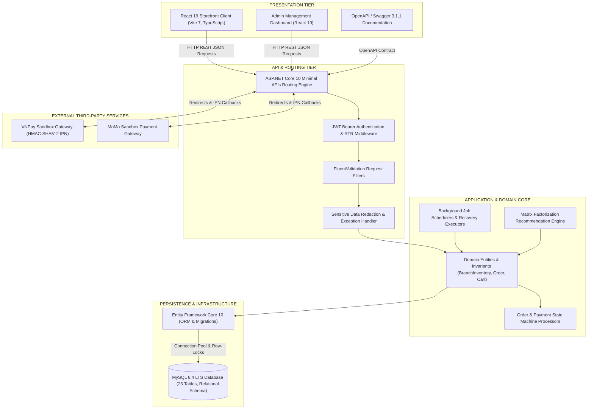
```mermaid
graph TD
    subgraph Presentation_Tier ["PRESENTATION TIER"]
        STOREFRONT["React 19 Storefront Client (Vite 7, TypeScript)"]
        ADMIN_PORTAL["Admin Management Dashboard (React 19)"]
        SWAGGER_UI["OpenAPI / Swagger 3.1.1 Documentation"]
    end

    subgraph API_Gateway_Tier ["API & ROUTING TIER"]
        MINIMAL_APIS["ASP.NET Core 10 Minimal APIs Routing Engine"]
        AUTH_MIDDLEWARE["JWT Bearer Authentication & RTR Middleware"]
        VALIDATION_FILTER["FluentValidation Request Filters"]
        LOG_SANITIZER["Sensitive Data Redaction & Exception Handler"]
    end

    subgraph Application_Domain_Tier ["APPLICATION & DOMAIN CORE"]
        DOMAIN_MODELS["Domain Entities & Invariants (BranchInventory, Order, Cart)"]
        STATE_MACHINES["Order & Payment State Machine Processors"]
        BG_WORKERS["Background Job Schedulers & Recovery Executors"]
        ML_RECOMMENDER["Matrix Factorization Recommendation Engine"]
    end

    subgraph Persistence_Infrastructure_Tier ["PERSISTENCE & INFRASTRUCTURE"]
        EF_CORE["Entity Framework Core 10 (ORM & Migrations)"]
        MYSQL_DB[("MySQL 8.4 LTS Database (23 Tables, Relational Schema)")]
    end

    subgraph External_Services ["EXTERNAL THIRD-PARTY SERVICES"]
        VNPAY_GW["VNPay Sandbox Gateway (HMAC-SHA512 IPN)"]
        MOMO_GW["MoMo Sandbox Payment Gateway"]
    end

    STOREFRONT -->|HTTP REST JSON Requests| MINIMAL_APIS
    ADMIN_PORTAL -->|HTTP REST JSON Requests| MINIMAL_APIS
    SWAGGER_UI -->|OpenAPI Contract| MINIMAL_APIS

    MINIMAL_APIS --> AUTH_MIDDLEWARE
    AUTH_MIDDLEWARE --> VALIDATION_FILTER
    VALIDATION_FILTER --> LOG_SANITIZER
    LOG_SANITIZER --> DOMAIN_MODELS

    DOMAIN_MODELS --> STATE_MACHINES
    DOMAIN_MODELS --> EF_CORE
    BG_WORKERS --> DOMAIN_MODELS
    ML_RECOMMENDER --> DOMAIN_MODELS

    EF_CORE -->|Connection Pool & Row-Locks| MYSQL_DB

    MINIMAL_APIS <-->|Redirects & IPN Callbacks| VNPAY_GW
    MINIMAL_APIS <-->|Redirects & IPN Callbacks| MOMO_GW
```

---

## 3.2. Data Flow Diagrams (DFDs)

### Context Level Diagram (System Boundary)
In this Context Diagram, all data flows are strictly labeled by the **transmitted business data payload**:

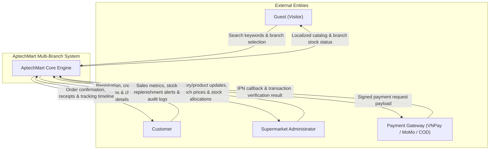
```mermaid
graph TD
    subgraph External_Entities ["External Entities"]
        GUEST["Guest (Visitor)"]
        CUST["Customer"]
        ADMIN["Supermarket Administrator"]
        PAYMENT["Payment Gateway (VNPay / MoMo / COD)"]
    end

    subgraph System_Core ["AptechMart Multi-Branch System"]
        SYSTEM["AptechMart Core Engine"]
    end

    GUEST -->|Search keywords & branch selection| SYSTEM
    SYSTEM -->|Localized catalog & branch stock status| GUEST

    CUST -->|Registration, credentials, cart items & checkout details| SYSTEM
    SYSTEM -->|Order confirmation, receipts & tracking timeline| CUST

    ADMIN -->|Category/product updates, branch prices & stock allocations| SYSTEM
    SYSTEM -->|Sales metrics, stock replenishment alerts & audit logs| ADMIN

    SYSTEM -->|Signed payment request payload| PAYMENT
    PAYMENT -->|IPN callback & transaction verification result| SYSTEM
```

---

### Level 0 DFD (Subsystem Decomposition)


```mermaid
flowchart TD
    %% External Entities
    GUEST["Guest"]
    CUST["Customer"]
    ADMIN["Administrator"]
    GW["Payment Gateway"]

    %% Data Stores
    D1[("D1: categories, brands, products")]
    D2[("D2: users, refresh_tokens, addresses")]
    D3[("D3: branches, branch_inventories")]
    D4[("D4: carts, cart_items")]
    D5[("D5: orders, order_items, order_status_histories")]
    D6[("D6: payments, payment_callbacks")]
    D7[("D7: reviews")]
    D8[("D8: demand_forecasts, recommendation_results")]

    %% Processes
    P1["P.1 Browse Catalog & Search"]
    P2["P.2 Identity & Address Management"]
    P3["P.3 Shopping Cart Mutation"]
    P4["P.4 Transactional Checkout & Stock Reservation"]
    P5["P.5 Payment Processing & IPN Verification"]
    P6["P.6 Verified Reviews"]
    P7["P.7 Catalog & Product Administration"]
    P8["P.8 Branch Inventory & Pricing Allocation"]
    P9["P.9 Order Fulfillment Lifecycle"]
    P10["P.10 User Governance & Security"]
    P11["P.11 Sales & Analytics Reporting"]
    P12["P.12 Demand Forecast & Recommendation"]

    %% Flows
    GUEST -->|Search query & branch filter| P1
    P1 <-->|Read product details & branch stock| D1
    P1 <-->|Read localized stock| D3
    P1 -->|Product cards & pricing| GUEST

    CUST -->|Credentials & address updates| P2
    P2 <-->|User credentials, tokens & addresses| D2
    P2 -->|Profile state & token pairs| CUST

    CUST -->|Item selections & quantity changes| P3
    P3 <-->|Active cart lines| D4
    P3 <-->|Verify available stock| D3
    P3 -->|Cart subtotal & item counts| CUST

    CUST -->|Checkout confirmation & shipping address| P4
    P4 <-->|Cart contents| D4
    P4 -->|Acquire lock & reserve stock| D3
    P4 -->|Create order snapshot & status history| D5
    P4 -->|Clear cart| D4
    P4 -->|Order ID & payment redirect URL| CUST

    P4 -->|Payment initiation payload| P5
    P5 -->|Redirect payload| GW
    GW -->|Signed IPN callback payload| P5
    P5 <-->|Verify idempotency & record payment| D6
    P5 -->|Update order to Processing| D5

    CUST -->|Product rating & commentary| P6
    P6 <-->|Verify completed purchase| D5
    P6 -->|Save rating| D7

    ADMIN -->|Category, brand & product definitions| P7
    P7 -->|Persist catalog structure| D1

    ADMIN -->|Branch selling prices & replenished quantities| P8
    P8 -->|Update localized stock & prices| D3

    ADMIN -->|Order fulfillment status updates| P9
    P9 <-->|Read pending orders & advance status| D5
    P9 -->|Deduct on-hand & reserved stock upon completion| D3

    ADMIN -->|Lock user account & revoke access| P10
    P10 -->|Revoke refresh tokens| D2

    ADMIN -->|Report filter parameters| P11
    P11 <-->|Aggregate fulfilled order transactions| D5
    P11 -->|Sales performance charts & KPIs| ADMIN

    P12 <-->|Read sales velocity & branch stock| D3
    P12 <-->|Read order history| D5
    P12 -->|Generate restocking alerts & ML scores| D8
    P12 -->|Forecast summary| ADMIN
```

---

## 3.3. Business Process Flowcharts & State Machines

### Authentication & Token Rotation Flowchart

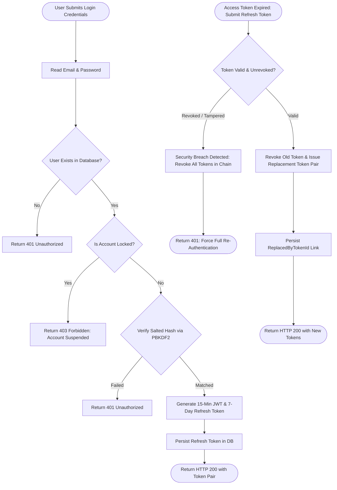
```mermaid
flowchart TD
    START([User Submits Login Credentials]) --> INPUT[Read Email & Password]
    INPUT --> FIND{User Exists in Database?}
    FIND -- No --> REJECT_AUTH[Return 401 Unauthorized]
    FIND -- Yes --> CHECK_LOCKED{Is Account Locked?}
    CHECK_LOCKED -- Yes --> REJECT_LOCKED[Return 403 Forbidden: Account Suspended]
    CHECK_LOCKED -- No --> VERIFY_PW{Verify Salted Hash via PBKDF2}
    VERIFY_PW -- Failed --> REJECT_PW[Return 401 Unauthorized]
    VERIFY_PW -- Matched --> GEN_TOKENS[Generate 15-Min JWT & 7-Day Refresh Token]
    GEN_TOKENS --> SAVE_TOKEN[Persist Refresh Token in DB]
    SAVE_TOKEN --> RETURN_OK([Return HTTP 200 with Token Pair])

    REFRESH_REQ([Access Token Expired: Submit Refresh Token]) --> CHECK_VALID{Token Valid & Unrevoked?}
    CHECK_VALID -- Revoked / Tampered --> DETECT_ATTACK[Security Breach Detected: Revoke All Tokens in Chain]
    DETECT_ATTACK --> REQUIRE_LOGIN([Return 401: Force Full Re-Authentication])
    CHECK_VALID -- Valid --> ROTATE_TOKEN[Revoke Old Token & Issue Replacement Token Pair]
    ROTATE_TOKEN --> SAVE_ROTATION[Persist ReplacedByTokenId Link]
    SAVE_ROTATION --> RETURN_ROTATED([Return HTTP 200 with New Tokens])
```

---

### Transactional Checkout & Stock Reservation Flowchart

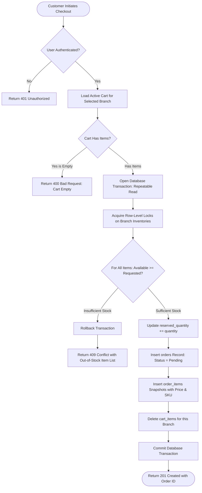
```mermaid
flowchart TD
    START([Customer Initiates Checkout]) --> CHECK_AUTH{User Authenticated?}
    CHECK_AUTH -- No --> ERR_AUTH[Return 401 Unauthorized]
    CHECK_AUTH -- Yes --> READ_CART[Load Active Cart for Selected Branch]
    READ_CART --> CART_EMPTY{Cart Has Items?}
    CART_EMPTY -- Yes is Empty --> ERR_EMPTY[Return 400 Bad Request: Cart Empty]
    CART_EMPTY -- Has Items --> OPEN_TX[Open Database Transaction: Repeatable Read]
    
    OPEN_TX --> LOCK_ROWS[Acquire Row-Level Locks on Branch Inventories]
    LOCK_ROWS --> VALIDATE_STOCK{For All Items: Available >= Requested?}
    
    VALIDATE_STOCK -- Insufficient Stock --> ROLLBACK[Rollback Transaction]
    ROLLBACK --> RET_409[Return 409 Conflict with Out-of-Stock Item List]
    
    VALIDATE_STOCK -- Sufficient Stock --> RESERVE[Update reserved_quantity += quantity]
    RESERVE --> CREATE_ORDER[Insert orders Record: Status = Pending]
    CREATE_ORDER --> SNAPSHOT_ITEMS[Insert order_items Snapshots with Price & SKU]
    SNAPSHOT_ITEMS --> CLEAR_CART[Delete cart_items for this Branch]
    CLEAR_CART --> COMMIT_TX[Commit Database Transaction]
    COMMIT_TX --> SUCCESS([Return 201 Created with Order ID])
```

---

### Order Lifecycle State Machine Diagram

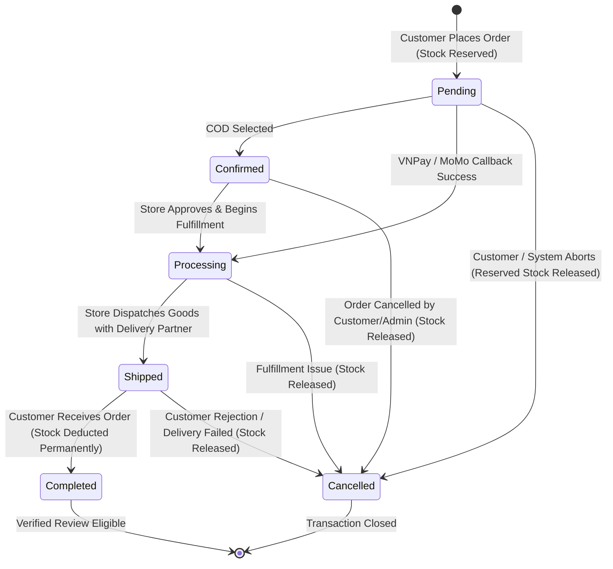
```mermaid
stateDiagram-v2
    [*] --> Pending : Customer Places Order (Stock Reserved)
    Pending --> Confirmed : COD Selected
    Pending --> Processing : VNPay / MoMo Callback Success
    Pending --> Cancelled : Customer / System Aborts (Reserved Stock Released)

    Confirmed --> Processing : Store Approves & Begins Fulfillment
    Confirmed --> Cancelled : Order Cancelled by Customer/Admin (Stock Released)

    Processing --> Shipped : Store Dispatches Goods with Delivery Partner
    Processing --> Cancelled : Fulfillment Issue (Stock Released)

    Shipped --> Completed : Customer Receives Order (Stock Deducted Permanently)
    Shipped --> Cancelled : Customer Rejection / Delivery Failed (Stock Released)

    Completed --> [*] : Verified Review Eligible
    Cancelled --> [*] : Transaction Closed
```

---

### Payment Process & IPN Webhook Idempotency Flowchart

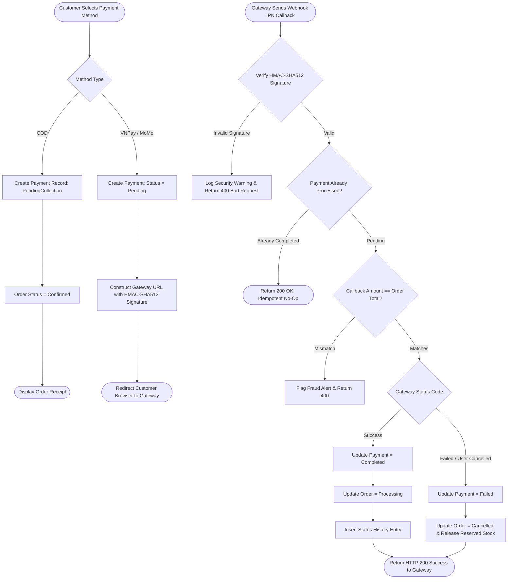
```mermaid
flowchart TD
    START([Customer Selects Payment Method]) --> CHECK_METHOD{Method Type}
    
    CHECK_METHOD -- COD --> COD_PATH[Create Payment Record: PendingCollection]
    COD_PATH --> CONFIRM_ORDER[Order Status = Confirmed]
    CONFIRM_ORDER --> RETURN_COD([Display Order Receipt])
    
    CHECK_METHOD -- VNPay / MoMo --> CREATE_PAYMENT[Create Payment: Status = Pending]
    CREATE_PAYMENT --> BUILD_URL[Construct Gateway URL with HMAC-SHA512 Signature]
    BUILD_URL --> REDIRECT([Redirect Customer Browser to Gateway])
    
    GATEWAY_CB([Gateway Sends Webhook IPN Callback]) --> VERIFY_SIG{Verify HMAC-SHA512 Signature}
    VERIFY_SIG -- Invalid Signature --> REJECT_CB[Log Security Warning & Return 400 Bad Request]
    
    VERIFY_SIG -- Valid --> CHECK_IDEMPOTENCY{Payment Already Processed?}
    CHECK_IDEMPOTENCY -- Already Completed --> RETURN_IDEMPOTENT([Return 200 OK: Idempotent No-Op])
    
    CHECK_IDEMPOTENCY -- Pending --> VERIFY_AMT{Callback Amount == Order Total?}
    VERIFY_AMT -- Mismatch --> REJECT_AMT[Flag Fraud Alert & Return 400]
    
    VERIFY_AMT -- Matches --> CHECK_STATUS{Gateway Status Code}
    CHECK_STATUS -- Success --> MARK_COMPLETED[Update Payment = Completed]
    MARK_COMPLETED --> UPDATE_ORDER[Update Order = Processing]
    UPDATE_ORDER --> RECORD_HIST[Insert Status History Entry]
    RECORD_HIST --> ACK_GW([Return HTTP 200 Success to Gateway])
    
    CHECK_STATUS -- Failed / User Cancelled --> MARK_FAILED[Update Payment = Failed]
    MARK_FAILED --> CANCEL_ORDER[Update Order = Cancelled & Release Reserved Stock]
    CANCEL_ORDER --> ACK_GW
```

---

## 3.4. Database Design (ERD & Data Dictionary)

### Entity-Relationship Diagram (ERD - 23 Tables)

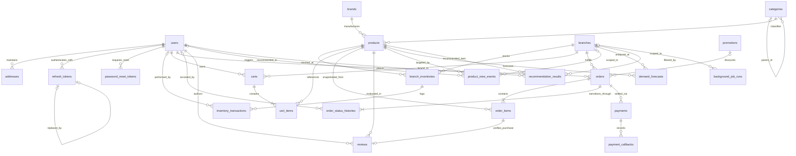
```mermaid
erDiagram
    users ||--o{ addresses : "maintains"
    users ||--o{ refresh_tokens : "authenticates_with"
    users ||--o{ password_reset_tokens : "requests_reset"
    refresh_tokens o|--o| refresh_tokens : "replaced_by"

    categories o|--o{ categories : "parent_of"
    categories ||--o{ products : "classifies"
    brands ||--o{ products : "manufactures"
    
    branches ||--o{ branch_inventories : "stocks"
    products ||--o{ branch_inventories : "stocked_at"
    branch_inventories ||--o{ inventory_transactions : "logs"
    users o|--o{ inventory_transactions : "performed_by"

    users ||--o{ carts : "owns"
    branches ||--o{ carts : "bound_to"
    carts ||--|{ cart_items : "contains"
    products ||--o{ cart_items : "references"

    users ||--o{ orders : "places"
    branches ||--o{ orders : "fulfills"
    promotions o|--o{ orders : "discounts"
    orders ||--|{ order_items : "contains"
    products ||--o{ order_items : "snapshotted_from"
    orders ||--|{ order_status_histories : "transitions_through"
    users o|--o{ order_status_histories : "recorded_by"

    orders ||--o{ payments : "settled_via"
    payments ||--o{ payment_callbacks : "records"

    users ||--o{ reviews : "authors"
    products ||--o{ reviews : "evaluated_in"
    order_items ||--o| reviews : "verifies_purchase"

    users o|--o{ product_view_events : "triggers"
    products ||--o{ product_view_events : "targeted_by"
    branches o|--o{ product_view_events : "scoped_to"

    products ||--o{ demand_forecasts : "forecasts"
    branches ||--o{ demand_forecasts : "analyzed_at"

    users ||--o{ recommendation_results : "recommended_to"
    products ||--o{ recommendation_results : "recommended_item"
    branches o|--o{ recommendation_results : "filtered_by"

    branches o|--o{ background_job_runs : "scoped_to"
```

---

### Comprehensive Data Dictionary (All 23 Canonical Tables)

#### 1. `branches` (Physical Supermarket Locations)
| Column Name | Data Type | Nullable | Key / Constraint | Description |
| :--- | :--- | :---: | :--- | :--- |
| `id` | char(36) | NO | PK, UUID v7 | Unique physical branch identifier. |
| `name` | varchar(255) | NO | Non-empty | Physical branch commercial name (e.g. Cau Giay Branch). |
| `code` | varchar(50) | NO | UNIQUE | Unique short code for branch routing. |
| `address` | varchar(500) | NO | Non-empty | Physical street address of the supermarket store. |
| `phone_number`| varchar(20) | YES | Phone format | Direct customer support contact number. |
| `is_active` | tinyint(1) | NO | DEFAULT 1 | Operating status flag. |
| `created_at` | datetime(6) | NO | Timestamp | Branch registration date. |
| `updated_at` | datetime(6) | YES | Timestamp | Last record modification timestamp. |

#### 2. `categories` (Product Classification Hierarchy)
| Column Name | Data Type | Nullable | Key / Constraint | Description |
| :--- | :--- | :---: | :--- | :--- |
| `id` | char(36) | NO | PK, UUID v7 | Unique category identifier. |
| `parent_id` | char(36) | YES | FK -> `categories.id` | Self-referencing parent category pointer. |
| `name` | varchar(255) | NO | Non-empty | Category display name. |
| `slug` | varchar(255) | NO | UNIQUE, Index | SEO-friendly URL slug. |
| `description` | text | YES | | Category marketing description. |
| `display_order`| int | NO | DEFAULT 0 | Visual sort ordering weight. |
| `is_active` | tinyint(1) | NO | DEFAULT 1 | Active visibility toggle. |
| `created_at` | datetime(6) | NO | Timestamp | Category creation timestamp. |
| `updated_at` | datetime(6) | YES | Timestamp | Last update timestamp. |

#### 3. `brands` (Product Manufacturers)
| Column Name | Data Type | Nullable | Key / Constraint | Description |
| :--- | :--- | :---: | :--- | :--- |
| `id` | char(36) | NO | PK, UUID v7 | Unique brand identifier. |
| `name` | varchar(255) | NO | Non-empty | Brand corporate name (e.g. Samsung, LG). |
| `slug` | varchar(255) | NO | UNIQUE, Index | URL slug identifier. |
| `logo_url` | varchar(500) | YES | URL format | Brand logo graphic URL. |
| `is_active` | tinyint(1) | NO | DEFAULT 1 | Active brand status toggle. |
| `created_at` | datetime(6) | NO | Timestamp | Record creation timestamp. |
| `updated_at` | datetime(6) | YES | Timestamp | Modification timestamp. |

#### 4. `products` (Global Product Master Catalog)
| Column Name | Data Type | Nullable | Key / Constraint | Description |
| :--- | :--- | :---: | :--- | :--- |
| `id` | char(36) | NO | PK, UUID v7 | Unique product master identifier. |
| `category_id` | char(36) | NO | FK -> `categories.id` | Associated product category. |
| `brand_id` | char(36) | NO | FK -> `brands.id` | Associated manufacturer brand. |
| `name` | varchar(255) | NO | Index | Global product commercial name. |
| `slug` | varchar(255) | NO | UNIQUE, Index | Unique product URL slug. |
| `sku` | varchar(100) | NO | UNIQUE, Index | Global Stock Keeping Unit (SKU) barcode. |
| `unit` | varchar(50) | NO | Non-empty | Unit of measure (e.g. Piece, Box, Kg). |
| `description` | longtext | YES | | Comprehensive product description. |
| `specifications`| json | YES | Valid JSON | Key-value technical specifications table. |
| `image_urls` | json | YES | Valid JSON | Array of product image URLs. |
| `is_active` | tinyint(1) | NO | DEFAULT 1 | Global product active status. |
| `created_at` | datetime(6) | NO | Timestamp | Record creation timestamp. |
| `updated_at` | datetime(6) | YES | Timestamp | Modification timestamp. |

#### 5. `branch_inventories` (Localized Branch Pricing & Stock)
| Column Name | Data Type | Nullable | Key / Constraint | Description |
| :--- | :--- | :---: | :--- | :--- |
| `id` | char(36) | NO | PK, UUID v7 | Unique branch inventory record ID. |
| `branch_id` | char(36) | NO | FK -> `branches.id`, UQ1 | Supermarket branch location. |
| `product_id` | char(36) | NO | FK -> `products.id`, UQ1 | Stocked product master. |
| `selling_price`| decimal(18,2)| NO | CHECK >= 0 | Localized retail unit price at this branch. |
| `quantity_on_hand`| int | NO | CHECK >= 0, >= reserved | Physical units present in supermarket stockroom. |
| `reserved_quantity`| int | NO | CHECK >= 0 | Units locked for active pending checkouts. |
| `reorder_level`| int | NO | CHECK >= 0, DEFAULT 5 | Minimum threshold triggering replenishment alerts. |
| `created_at` | datetime(6) | NO | Timestamp | Inventory record initial date. |
| `updated_at` | datetime(6) | YES | Timestamp | Last stock or price update timestamp. |

*(Unique index `UQ_branch_inventories_branch_product` enforces one inventory record per branch-product pair).*

#### 6. `users` (Identity & User Accounts)
| Column Name | Data Type | Nullable | Key / Constraint | Description |
| :--- | :--- | :---: | :--- | :--- |
| `id` | char(36) | NO | PK, UUID v7 | Unique user identifier. |
| `email` | varchar(255) | NO | UNIQUE, Index | Unique authentication email address. |
| `password_hash`| varchar(500) | NO | PBKDF2 format | Cryptographically salted PBKDF2 password hash. |
| `full_name` | varchar(255) | NO | Non-empty | User legal name. |
| `phone_number`| varchar(20) | YES | | Contact telephone number. |
| `role` | varchar(50) | NO | DEFAULT 'Customer'| System role (`Customer` or `Admin`). |
| `is_locked` | tinyint(1) | NO | DEFAULT 0 | Administrative lockout toggle. |
| `created_at` | datetime(6) | NO | Timestamp | Account registration timestamp. |
| `updated_at` | datetime(6) | YES | Timestamp | Last profile update. |

#### 7. `addresses` (Customer Delivery Address Book)
| Column Name | Data Type | Nullable | Key / Constraint | Description |
| :--- | :--- | :---: | :--- | :--- |
| `id` | char(36) | NO | PK, UUID v7 | Unique shipping address record ID. |
| `user_id` | char(36) | NO | FK -> `users.id`, Index | Owning customer account. |
| `recipient_name`| varchar(255)| NO | Non-empty | Contact person at delivery destination. |
| `phone_number`| varchar(20) | NO | Non-empty | Delivery contact phone number. |
| `street` | varchar(500) | NO | Non-empty | House number and street name. |
| `ward` | varchar(100) | YES | | Ward or neighborhood jurisdiction. |
| `district` | varchar(100) | NO | Non-empty | Urban district name. |
| `city` | varchar(100) | NO | Non-empty | Province or municipality name. |
| `is_default` | tinyint(1) | NO | DEFAULT 0 | Flag designating primary shipping address. |
| `created_at` | datetime(6) | NO | Timestamp | Address creation date. |
| `updated_at` | datetime(6) | YES | Timestamp | Modification date. |

#### 8. `refresh_tokens` (JWT Refresh Token Rotation)
| Column Name | Data Type | Nullable | Key / Constraint | Description |
| :--- | :--- | :---: | :--- | :--- |
| `id` | char(36) | NO | PK, UUID v7 | Unique token record ID. |
| `user_id` | char(36) | NO | FK -> `users.id`, Index | Token holder account. |
| `token` | varchar(500) | NO | UNIQUE, Index | Cryptographic token string. |
| `expires_at` | datetime(6) | NO | Timestamp | Expiration deadline. |
| `is_revoked` | tinyint(1) | NO | DEFAULT 0 | Revocation status flag. |
| `replaced_by_token_id`| char(36)| YES | FK -> `refresh_tokens.id` | Descendant token reference in rotation chain. |
| `created_at` | datetime(6) | NO | Timestamp | Token issuance timestamp. |

#### 9. `password_reset_tokens` (Account Recovery)
| Column Name | Data Type | Nullable | Key / Constraint | Description |
| :--- | :--- | :---: | :--- | :--- |
| `id` | char(36) | NO | PK, UUID v7 | Unique reset token ID. |
| `user_id` | char(36) | NO | FK -> `users.id`, Index | Target user account. |
| `token` | varchar(500) | NO | UNIQUE | Single-use recovery token. |
| `expires_at` | datetime(6) | NO | Timestamp | Token expiration (usually 1 hour). |
| `is_used` | tinyint(1) | NO | DEFAULT 0 | Single-use redemption flag. |
| `created_at` | datetime(6) | NO | Timestamp | Issuance timestamp. |

#### 10. `carts` (Branch-Scoped Customer Carts)
| Column Name | Data Type | Nullable | Key / Constraint | Description |
| :--- | :--- | :---: | :--- | :--- |
| `id` | char(36) | NO | PK, UUID v7 | Unique cart identifier. |
| `user_id` | char(36) | NO | FK -> `users.id`, Index | Owning customer. |
| `branch_id` | char(36) | NO | FK -> `branches.id` | Physical supermarket branch fulfilling this cart. |
| `created_at` | datetime(6) | NO | Timestamp | Cart creation timestamp. |
| `updated_at` | datetime(6) | YES | Timestamp | Last cart mutation timestamp. |

#### 11. `cart_items` (Individual Cart Line Items)
| Column Name | Data Type | Nullable | Key / Constraint | Description |
| :--- | :--- | :---: | :--- | :--- |
| `id` | char(36) | NO | PK, UUID v7 | Unique cart line ID. |
| `cart_id` | char(36) | NO | FK -> `carts.id`, UQ1 | Owning cart. |
| `product_id` | char(36) | NO | FK -> `products.id`, UQ1 | Selected product. |
| `quantity` | int | NO | CHECK > 0 | Selected unit count. |
| `created_at` | datetime(6) | NO | Timestamp | Addition timestamp. |
| `updated_at` | datetime(6) | YES | Timestamp | Quantity update timestamp. |

#### 12. `promotions` (Discount Campaigns & Coupons)
| Column Name | Data Type | Nullable | Key / Constraint | Description |
| :--- | :--- | :---: | :--- | :--- |
| `id` | char(36) | NO | PK, UUID v7 | Unique promotion record ID. |
| `code` | varchar(50) | NO | UNIQUE, Index | Customer promotional coupon code (e.g. SALE10). |
| `description` | varchar(500) | YES | | Promotional terms and conditions description. |
| `discount_type`| varchar(20) | NO | 'Percentage'/'Fixed' | Discount calculation mechanism. |
| `discount_value`| decimal(18,2)| NO | CHECK > 0 | Discount rate percentage or currency amount. |
| `min_order_amount`| decimal(18,2)| NO | DEFAULT 0 | Minimum cart subtotal qualifying for promotion. |
| `max_discount_amount`| decimal(18,2)| YES | | Ceiling cap for percentage discounts. |
| `max_uses` | int | NO | CHECK > 0 | Total allowed redemptions across all users. |
| `times_used` | int | NO | DEFAULT 0 | Current completed redemptions count. |
| `start_date` | datetime(6) | NO | Timestamp | Campaign activation timestamp. |
| `end_date` | datetime(6) | NO | Timestamp | Campaign expiration timestamp. |
| `is_active` | tinyint(1) | NO | DEFAULT 1 | Manual promotion toggle. |
| `created_at` | datetime(6) | NO | Timestamp | Record creation timestamp. |
| `updated_at` | datetime(6) | YES | Timestamp | Record modification timestamp. |

#### 13. `orders` (Fulfilled and Pending Retail Orders)
| Column Name | Data Type | Nullable | Key / Constraint | Description |
| :--- | :--- | :---: | :--- | :--- |
| `id` | char(36) | NO | PK, UUID v7 | Unique order identifier. |
| `order_number` | varchar(50) | NO | UNIQUE, Index | Human-readable tracking number (e.g. ORD-2026-0001).|
| `user_id` | char(36) | NO | FK -> `users.id`, Index | Customer placing the order. |
| `branch_id` | char(36) | NO | FK -> `branches.id` | Supermarket branch fulfilling and packing goods. |
| `promotion_id` | char(36) | YES | FK -> `promotions.id` | Applied discount campaign (if any). |
| `fulfillment_mode`| varchar(20)| NO | 'Delivery'/'Pickup' | Shipping mode selected by customer. |
| `status` | varchar(30) | NO | Index | State (`Pending`,`Confirmed`,`Processing`,`Shipped`,`Completed`,`Cancelled`). |
| `subtotal` | decimal(18,2)| NO | CHECK >= 0 | Raw item total before discounts and fees. |
| `discount_amount`| decimal(18,2)| NO | DEFAULT 0 | Total discount applied from promotion. |
| `shipping_fee` | decimal(18,2)| NO | DEFAULT 0 | Expedited logistics delivery fee. |
| `total_amount` | decimal(18,2)| NO | CHECK >= 0 | Final grand total payable (`subtotal - discount + fee`).|
| `shipping_address`| json | YES | Valid JSON | Immutable snapshot of recipient shipping coordinates.|
| `notes` | text | YES | | Special delivery instructions from customer. |
| `created_at` | datetime(6) | NO | Timestamp, Index | Order placement timestamp. |
| `updated_at` | datetime(6) | YES | Timestamp | Last state transition timestamp. |

#### 14. `order_items` (Immutable Order Line Snapshots)
| Column Name | Data Type | Nullable | Key / Constraint | Description |
| :--- | :--- | :---: | :--- | :--- |
| `id` | char(36) | NO | PK, UUID v7 | Unique line item identifier. |
| `order_id` | char(36) | NO | FK -> `orders.id`, Index | Associated parent order. |
| `product_id` | char(36) | NO | FK -> `products.id` | Master product reference. |
| `product_name` | varchar(255)| NO | Non-empty | Snapshot of product title at time of purchase. |
| `sku` | varchar(100) | NO | Non-empty | Snapshot of SKU barcode. |
| `unit_price` | decimal(18,2)| NO | CHECK >= 0 | Snapshot of locked unit selling price. |
| `quantity` | int | NO | CHECK > 0 | Number of units purchased. |
| `total_price` | decimal(18,2)| NO | CHECK >= 0 | Line total (`unit_price * quantity`). |
| `created_at` | datetime(6) | NO | Timestamp | Line creation timestamp. |

#### 15. `order_status_histories` (Order Audit Trail)
| Column Name | Data Type | Nullable | Key / Constraint | Description |
| :--- | :--- | :---: | :--- | :--- |
| `id` | char(36) | NO | PK, UUID v7 | Unique status log record ID. |
| `order_id` | char(36) | NO | FK -> `orders.id`, Index | Associated order. |
| `changed_by_user_id`| char(36)| YES | FK -> `users.id` | User or Admin triggering transition. |
| `from_status` | varchar(30) | YES | | Preceding order state. |
| `to_status` | varchar(30) | NO | Non-empty | Consequent order state. |
| `reason` | text | YES | | Context or explanation for status update. |
| `created_at` | datetime(6) | NO | Timestamp | Transition timestamp. |

#### 16. `payments` (Payment Records & Transactions)
| Column Name | Data Type | Nullable | Key / Constraint | Description |
| :--- | :--- | :---: | :--- | :--- |
| `id` | char(36) | NO | PK, UUID v7 | Unique payment transaction ID. |
| `order_id` | char(36) | NO | FK -> `orders.id`, Index | Associated order. |
| `payment_method`| varchar(50) | NO | 'COD'/'VNPay'/'MoMo' | Chosen payment rail. |
| `status` | varchar(30) | NO | Index | State (`Pending`,`Completed`,`Failed`,`Refunded`). |
| `amount` | decimal(18,2)| NO | CHECK >= 0 | Transaction monetary amount. |
| `transaction_id`| varchar(255)| YES | Index | External gateway transaction reference code. |
| `gateway_response`| text | YES | | Serialized payload response from gateway. |
| `created_at` | datetime(6) | NO | Timestamp | Payment initiation timestamp. |
| `updated_at` | datetime(6) | YES | Timestamp | Payment completion or failure timestamp. |

#### 17. `payment_callbacks` (Idempotent Webhook Log)
| Column Name | Data Type | Nullable | Key / Constraint | Description |
| :--- | :--- | :---: | :--- | :--- |
| `id` | char(36) | NO | PK, UUID v7 | Unique callback event ID. |
| `payment_id` | char(36) | NO | FK -> `payments.id` | Associated payment record. |
| `idempotency_key`| varchar(255)| NO | UNIQUE, Index | Unique signature hash preventing duplicate processing.|
| `raw_payload` | longtext | NO | Valid JSON/Form | Raw incoming request payload from gateway IPN. |
| `is_verified` | tinyint(1) | NO | DEFAULT 0 | Checksum signature verification outcome flag. |
| `created_at` | datetime(6) | NO | Timestamp | Webhook arrival timestamp. |

#### 18. `inventory_transactions` (Stock Movement Ledger)
| Column Name | Data Type | Nullable | Key / Constraint | Description |
| :--- | :--- | :---: | :--- | :--- |
| `id` | char(36) | NO | PK, UUID v7 | Unique inventory ledger event ID. |
| `branch_inventory_id`| char(36)| NO | FK -> `branch_inventories.id` | Targeted branch inventory record. |
| `user_id` | char(36) | YES | FK -> `users.id` | Operator performing stock movement. |
| `transaction_type`| varchar(50)| NO | Index | Type (`Reserve`,`Sale`,`CancelRelease`,`Restock`). |
| `quantity_delta`| int | NO | Non-zero | Stock movement magnitude (+/-). |
| `balance_after` | int | NO | CHECK >= 0 | Resulting stock on hand after transaction. |
| `operation_key`| varchar(255)| NO | UNIQUE, Index | Concurrency key preventing duplicate ledger entries. |
| `created_at` | datetime(6) | NO | Timestamp | Ledger recording timestamp. |

#### 19. `reviews` (Verified Customer Product Feedback)
| Column Name | Data Type | Nullable | Key / Constraint | Description |
| :--- | :--- | :---: | :--- | :--- |
| `id` | char(36) | NO | PK, UUID v7 | Unique review identifier. |
| `product_id` | char(36) | NO | FK -> `products.id`, Index | Reviewed product master. |
| `user_id` | char(36) | NO | FK -> `users.id`, Index | Customer submitting review. |
| `order_item_id`| char(36) | NO | FK -> `order_items.id`, UQ1 | Verified completed order line reference. |
| `rating` | int | NO | CHECK (1 <= rating <= 5) | Customer evaluation score (1 to 5 stars). |
| `comment` | text | YES | | Textual review and customer feedback. |
| `is_approved` | tinyint(1) | NO | DEFAULT 1 | Content moderation flag. |
| `created_at` | datetime(6) | NO | Timestamp | Review publication timestamp. |
| `updated_at` | datetime(6) | YES | Timestamp | Last edit timestamp. |

#### 20. `product_view_events` (Clickstream & Analytics Events)
| Column Name | Data Type | Nullable | Key / Constraint | Description |
| :--- | :--- | :---: | :--- | :--- |
| `id` | char(36) | NO | PK, UUID v7 | Unique interaction event ID. |
| `product_id` | char(36) | NO | FK -> `products.id`, Index | Viewed product master. |
| `user_id` | char(36) | YES | FK -> `users.id`, Index | Customer viewing item (null if guest). |
| `branch_id` | char(36) | YES | FK -> `branches.id` | Supermarket branch selected during view. |
| `session_id` | varchar(100) | NO | Index | Browser session correlation key. |
| `viewed_at` | datetime(6) | NO | Timestamp | Exact event timestamp. |

#### 21. `demand_forecasts` (Inventory Demand Forecasting)
| Column Name | Data Type | Nullable | Key / Constraint | Description |
| :--- | :--- | :---: | :--- | :--- |
| `id` | char(36) | NO | PK, UUID v7 | Unique forecast calculation ID. |
| `product_id` | char(36) | NO | FK -> `products.id`, UQ1 | Targeted product. |
| `branch_id` | char(36) | NO | FK -> `branches.id`, UQ1 | Target supermarket branch. |
| `forecast_date`| date | NO | UQ1 | Forecast projection target date. |
| `forecast_quantity`| decimal(18,2)| NO | CHECK >= 0 | Projected units demanded. |
| `confidence_level`| decimal(5,2)| NO | CHECK (0 <= conf <= 1) | Statistical model confidence score. |
| `generated_at` | datetime(6) | NO | Timestamp | Forecast model execution timestamp. |

#### 22. `recommendation_results` (Collaborative Filtering AI)
| Column Name | Data Type | Nullable | Key / Constraint | Description |
| :--- | :--- | :---: | :--- | :--- |
| `id` | char(36) | NO | PK, UUID v7 | Unique recommendation record ID. |
| `user_id` | char(36) | NO | FK -> `users.id`, UQ1 | Target customer receiving recommendation. |
| `product_id` | char(36) | NO | FK -> `products.id`, UQ1 | Recommended product item. |
| `branch_id` | char(36) | YES | FK -> `branches.id` | Filtered supermarket branch scope. |
| `score` | decimal(10,4)| NO | Finite | Predicted Matrix Factorization affinity score. |
| `generated_at` | datetime(6) | NO | Timestamp | Model batch generation timestamp. |

#### 23. `background_job_runs` (Job Scheduling & Concurrency Leases)
| Column Name | Data Type | Nullable | Key / Constraint | Description |
| :--- | :--- | :---: | :--- | :--- |
| `id` | char(36) | NO | PK, UUID v7 | Unique background execution run ID. |
| `job_name` | varchar(100) | NO | Index | Job identifier (e.g. DemandForecastJob, MLTrainJob).|
| `branch_id` | char(36) | YES | FK -> `branches.id` | Physical branch scope (null if global). |
| `status` | varchar(30) | NO | Index | State (`Queued`,`Running`,`Succeeded`,`Failed`). |
| `lease_token` | varchar(100) | YES | Concurrency guard | Distributed lease token preventing dual execution. |
| `lease_expires_at`| datetime(6)| YES | Timestamp | Concurrency lease expiration deadline. |
| `error_summary`| text | YES | Sanitized | Sanitized error diagnostic summary (secrets redacted).|
| `started_at` | datetime(6) | YES | Timestamp | Execution start timestamp. |
| `completed_at` | datetime(6) | YES | Timestamp | Final terminal state timestamp. |

<div style='page-break-after: always;'></div>

---

# CHAPTER 4: SYSTEM SCREENSHOTS & UI WALKTHROUGH

This chapter provides a comprehensive visual walkthrough of the **AptechMart** system, documenting the user interface layout, visual components, interaction affordances, and real operating screens across both the **Storefront Client** and **Admin Management Portal**.

---

## 4.1. Customer Storefront Interface

### Figure 4.1: Storefront Homepage & Physical Branch Selector
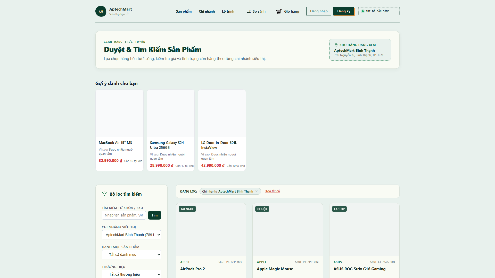

> **Figure 4.1 Storefront Homepage & Branch Selector**  
> This screen serves as the primary digital gateway for shoppers. The top navigation bar features the AptechMart brand identity, full-text catalog search, real-time cart badge counter, user account menu, and the prominent **Physical Branch Selector Dropdown**. Below the header, promotional banners highlight active campaigns, followed by localized best-selling categories and real-time product cards displaying branch-specific pricing and stock levels.

---

### Figure 4.2: Customer Authentication & Login Interface
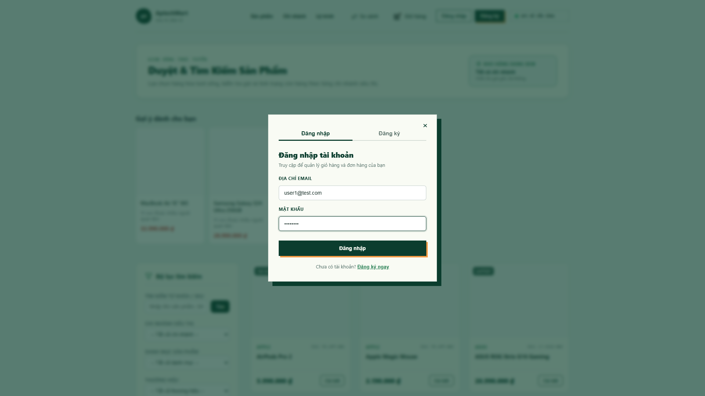

> **Figure 4.2 Customer Login Interface**  
> This interface facilitates secure customer authentication. Customers input their registered email address and password. The system applies client-side validation rules before submitting credentials over HTTPS to the `/api/auth/login` endpoint, which verifies the PBKDF2 salted hash and returns short-lived JWT access tokens and persistent refresh tokens.

---

### Figure 4.3: Customer Authenticated State & Profile Dashboard
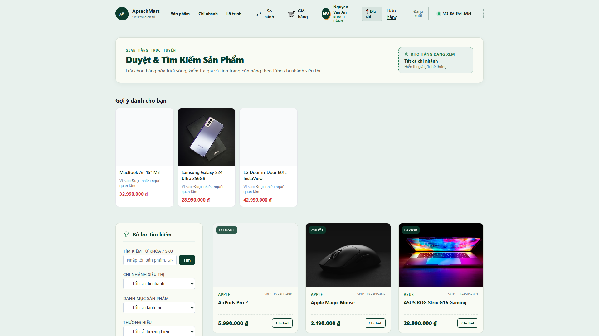

> **Figure 4.3 Customer Authenticated State**  
> This screen demonstrates the user interface following successful authentication. The header reflects the customer's identity with personalized navigation controls. Customers can seamlessly toggle into their profile dashboard, multi-point shipping address book, and order tracking history without leaving the shopping context.

---

### Figure 4.4: Product Catalogue & Multi-Facet Filtering
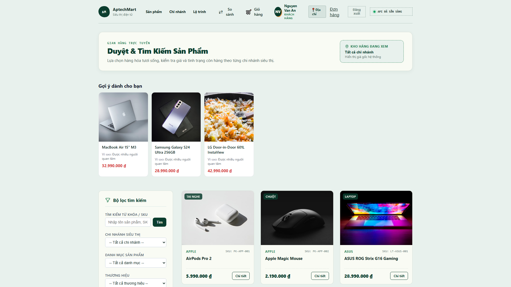

> **Figure 4.4 Product Catalogue & Filtering System**  
> This screen allows customers to browse the supermarket inventory with multi-faceted filtering criteria. The left sidebar provides interactive controls to narrow results by multi-tier categories, manufacturer brands, and price sliders in Vietnamese Dong (VND). The central grid presents matching product cards showing localized unit prices and in-stock badges for the active store location.

---

### Figure 4.5: Product Specification Detail View
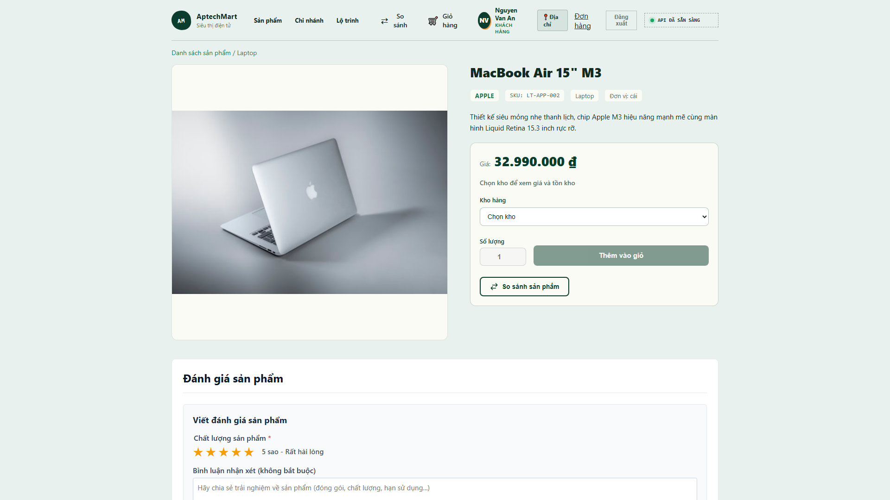

> **Figure 4.5 Product Detail & Localized Stock View**  
> This screen provides comprehensive product details, high-resolution thumbnail galleries, full technical specifications, and real-time stock availability specific to the active branch (e.g. *"8 units available at Cau Giay Branch"*). Shoppers can select desired quantities up to the branch availability ceiling, add items to their localized cart, or launch product comparison.

---

### Figure 4.6: Side-by-Side Product Comparison Modal
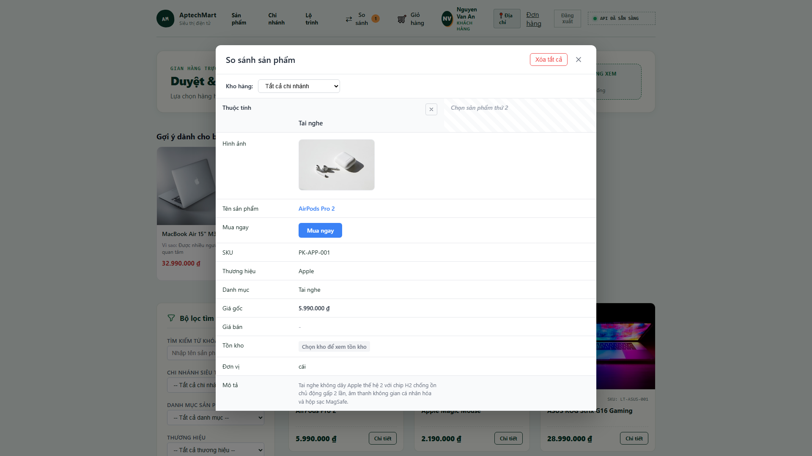

> **Figure 4.6 Product Comparison Modal**  
> This modal window provides a side-by-side technical specification comparison of 2 to 4 products within the same category (FR-104). The synchronized matrix aligns key technical attributes, prices, stock statuses, and user ratings, empowering customers to make informed purchasing choices.

---

### Figure 4.7: Branch-Aware Shopping Cart Management
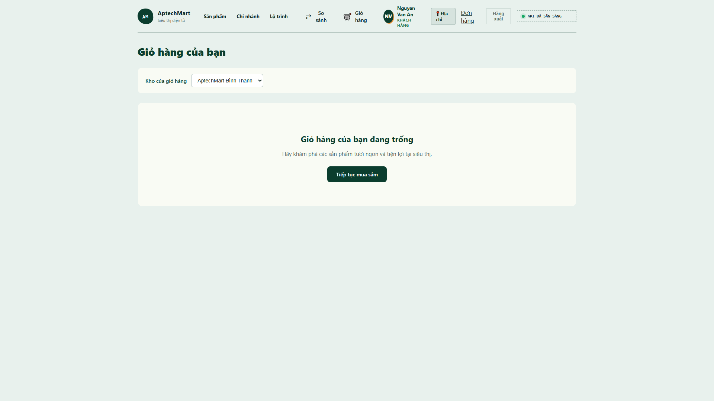

> **Figure 4.7 Shopping Cart Management**  
> This screen manages the customer's shopping cart bound to the chosen supermarket branch. Customers can adjust item quantities, remove items, review subtotal breakdowns, and verify that all requested items remain in stock at the physical branch prior to proceeding to checkout.

---

### Figure 4.8: Transactional Checkout & Delivery Selection
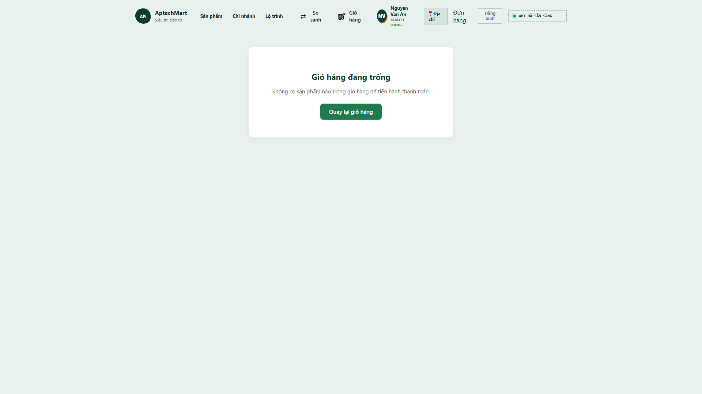

> **Figure 4.8 Checkout & Fulfillment Mode Selection**  
> This screen guides customers through the checkout process. Customers choose between "Home Delivery" (selecting a saved address from their address book) and "Store Pickup" (confirming in-person collection at the active branch). Promotional coupon codes can be entered to receive discounts, and final totals are computed in real time.

---

### Figure 4.9: Sandbox Payment Gateway Processing


> **Figure 4.9 Payment Gateway Selection & Redirection**  
> This screen presents available payment options: Cash on Delivery (COD), VNPay Sandbox, and MoMo Sandbox. When an online gateway is selected, the system builds an HMAC-SHA512 tamper-proof redirection payload, directing the user to the gateway sandbox and awaiting an asynchronous, idempotent Webhook IPN callback.

---

### Figure 4.10: Order History & Real-Time Tracking
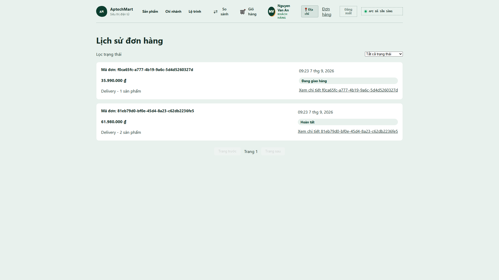

> **Figure 4.10 Order History & Status Timeline**  
> This screen displays the customer's chronological order history. Detailed views render item snapshots (locked prices and product names at purchase time), fulfillment method, payment status, and a visual state transition timeline (`Pending` $\rightarrow$ `Confirmed` $\rightarrow$ `Processing` $\rightarrow$ `Shipped` $\rightarrow$ `Completed`).

---

## 4.2. Administrator Management Portal

### Figure 4.11: Admin Multi-Level Category & Brand Management
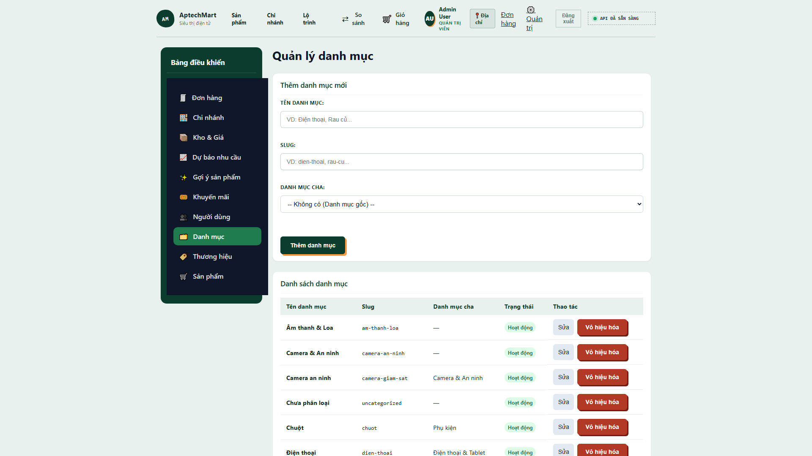

> **Figure 4.11 Admin Category & Brand Catalog**  
> This administrative interface allows store managers to organize the multi-tier category tree (parent categories and subcategories), assign SEO-friendly slugs, define display ordering, and curate the brand manufacturer directory.

---

### Figure 4.12: Admin Product Master & Global SKU Catalog
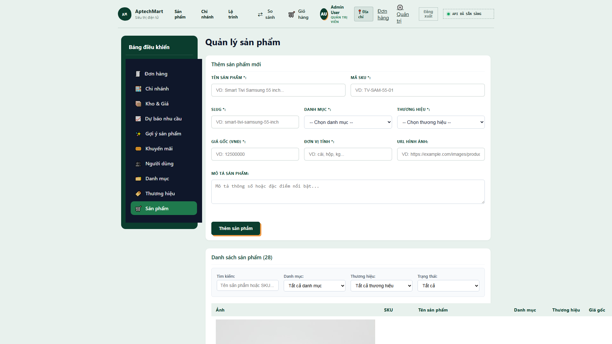

> **Figure 4.12 Admin Product Catalog Management**  
> This screen allows administrators to create and maintain global product records. Managers define commercial names, unique SKU barcodes, units of measure, image galleries, and structured technical specifications stored as JSON attributes.

---

### Figure 4.13: Admin Branch Pricing & Stockroom Replenishment
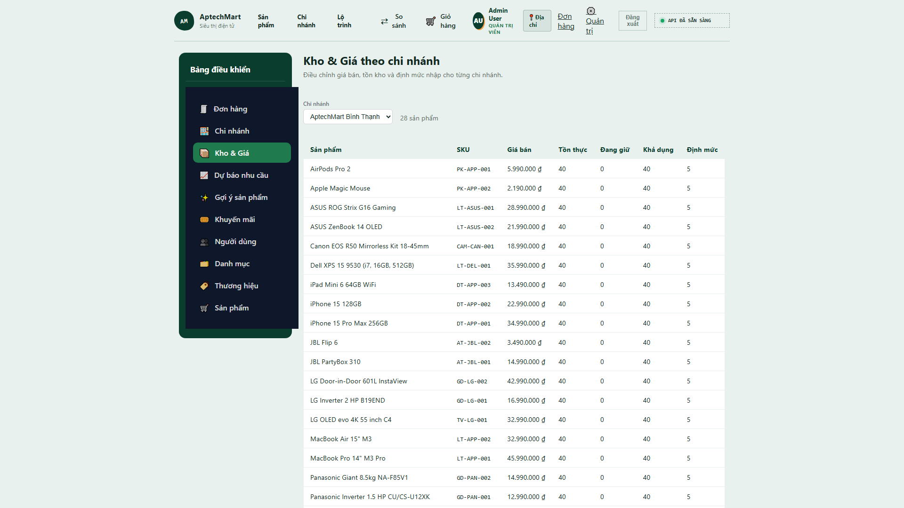

> **Figure 4.13 Branch-Specific Pricing & Inventory Management**  
> This operational screen allows store managers to set selling prices and adjust on-hand inventory levels (`quantity_on_hand`) independently for each supermarket branch. Input validation guards prevent setting on-hand stock lower than currently active reservations.

---

### Figure 4.14: Admin Order Management & State Transition Control
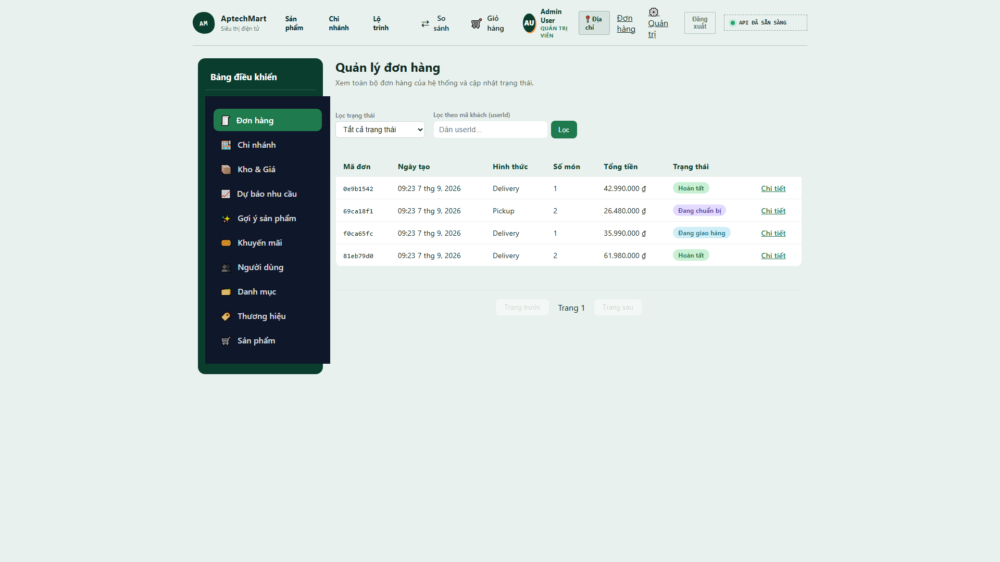

> **Figure 4.14 Admin Order Processing Dashboard**  
> This screen provides store staff with an aggregated view of all orders across branches. Staff can filter by fulfillment status, inspect delivery addresses, view payment receipts, and advance order state transitions strictly following the domain state machine.

---

### Figure 4.15: Admin User Governance & Access Revocation
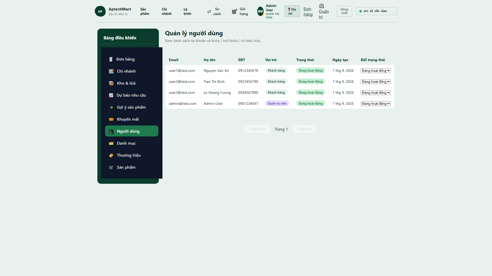

> **Figure 4.15 User Management & Account Lockout**  
> This security interface allows administrators to view all registered user accounts, inspect role assignments, and execute immediate account suspensions. Suspending an account instantly revokes all active refresh tokens, barring compromised users from accessing the system.

---

### Figure 4.16: Admin Sales Analytics & Demand Forecasting
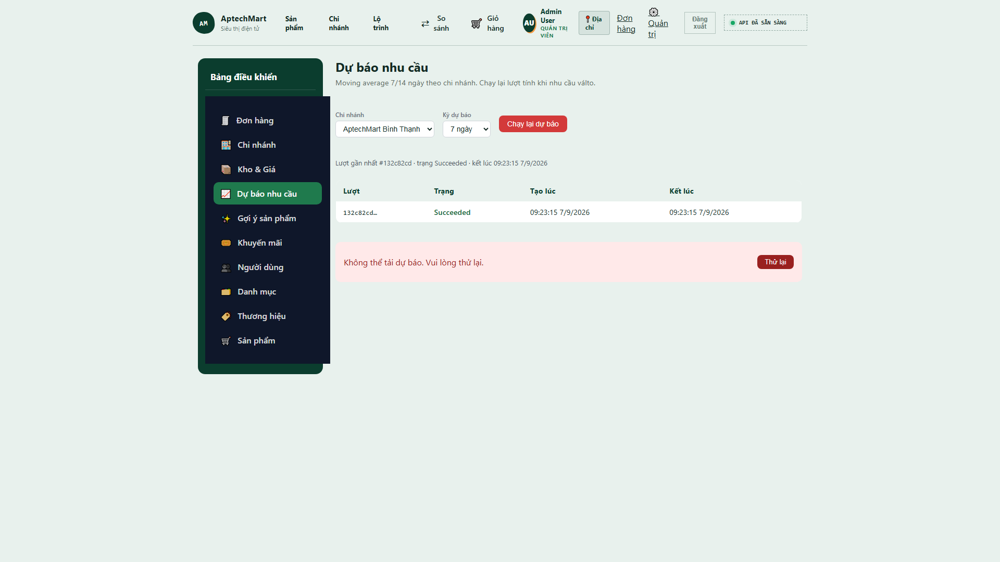

> **Figure 4.16 Sales Analytics & Restocking Alerts**  
> This analytical dashboard displays gross sales metrics, order fulfillment counts, and category revenue breakdowns. Below the financial KPIs, automated demand forecasting algorithms generate replenishment alert warnings for inventory items falling below store reorder thresholds.

<div style='page-break-after: always;'></div>

---

# CHAPTER 5: CORE SOURCE CODE WITH COMMENTS

This chapter presents 6 representative source code excerpts from the **AptechMart** solution. Each excerpt demonstrates clean architectural design, domain invariant protection, concurrency control, and robust error handling.

---

## 5.1. Domain Tier: Inventory Invariants & Atomic Stock Reservation

- **File**: `backend/src/OnlineSupermarket.Domain/Inventory/BranchInventory.cs`
- **Architectural Purpose**: Enforces domain invariants for branch-specific inventory. Guarantees that physical stock cannot be negative, reserved stock cannot exceed on-hand stock, and stock operations are properly encapsulated.

```csharp
namespace OnlineSupermarket.Domain.Inventory;

using OnlineSupermarket.Domain.Common;

/// <summary>
/// BranchInventory Aggregate: Manages isolated pricing and stock levels per physical store.
/// Encapsulates domain invariants protecting against overselling and concurrency violations.
/// </summary>
public class BranchInventory : BaseEntity
{
    public Guid BranchId { get; private set; }
    public Guid ProductId { get; private set; }
    public decimal SellingPrice { get; private set; }
    public int QuantityOnHand { get; private set; }
    public int ReservedQuantity { get; private set; }
    public int ReorderLevel { get; private set; }

    /// <summary>
    /// Computed available stock: Net units eligible for active customer purchase.
    /// Invariant: AvailableQuantity = QuantityOnHand - ReservedQuantity.
    /// </summary>
    public int AvailableQuantity => QuantityOnHand - ReservedQuantity;

    // EF Core parameterless constructor
    private BranchInventory() { }

    public BranchInventory(Guid branchId, Guid productId, decimal sellingPrice, int quantityOnHand, int reorderLevel = 5)
    {
        if (sellingPrice < 0)
            throw new DomainValidationException("Retail selling price cannot be negative.");
        if (quantityOnHand < 0)
            throw new DomainValidationException("Physical quantity on hand cannot be negative.");

        Id = Guid.NewGuid();
        BranchId = branchId;
        ProductId = productId;
        SellingPrice = sellingPrice;
        QuantityOnHand = quantityOnHand;
        ReservedQuantity = 0;
        ReorderLevel = reorderLevel;
    }

    /// <summary>
    /// Atomic Stock Reservation: Invoked inside transactional checkout.
    /// Verifies availability and places a temporary hold on the inventory.
    /// </summary>
    public void ReserveStock(int quantity)
    {
        if (quantity <= 0)
            throw new DomainValidationException("Quantity to reserve must be greater than zero.");
        if (quantity > AvailableQuantity)
            throw new DomainValidationException(
                $"Insufficient stock at branch. Available: {AvailableQuantity}, Requested: {quantity}.");

        ReservedQuantity += quantity;
    }

    /// <summary>
    /// Releases reserved stock when an order is cancelled or times out.
    /// </summary>
    public void ReleaseStock(int quantity)
    {
        if (quantity <= 0)
            throw new DomainValidationException("Quantity to release must be greater than zero.");
        if (quantity > ReservedQuantity)
            throw new DomainValidationException("Cannot release more stock than currently reserved.");

        ReservedQuantity -= quantity;
    }

    /// <summary>
    /// Permanently deducts stock upon order fulfillment completion.
    /// Decrements both on-hand quantity and reserved quantity simultaneously.
    /// </summary>
    public void DeductStock(int quantity)
    {
        if (quantity <= 0)
            throw new DomainValidationException("Quantity to deduct must be greater than zero.");
        if (quantity > ReservedQuantity)
            throw new DomainValidationException("Cannot deduct more than reserved quantity.");
        if (quantity > QuantityOnHand)
            throw new DomainValidationException("Cannot deduct more than physical quantity on hand.");

        ReservedQuantity -= quantity;
        QuantityOnHand -= quantity;
    }

    /// <summary>
    /// Administrative stock replenishment and pricing adjustments.
    /// </summary>
    public void UpdateInventory(decimal newPrice, int newQuantityOnHand, int newReorderLevel)
    {
        if (newPrice < 0)
            throw new DomainValidationException("Selling price cannot be negative.");
        if (newQuantityOnHand < ReservedQuantity)
            throw new DomainValidationException(
                $"New on-hand quantity ({newQuantityOnHand}) cannot be less than active reservations ({ReservedQuantity}).");

        SellingPrice = newPrice;
        QuantityOnHand = newQuantityOnHand;
        ReorderLevel = newReorderLevel;
    }
}
```

### Business Rule & Invariant Analysis
1. **Encapsulation of State**: All properties have `private set` accessors. Mutations occur strictly through domain methods (`ReserveStock`, `ReleaseStock`, `DeductStock`).
2. **Prevention of Overselling**: `AvailableQuantity` dynamically calculates available units (`QuantityOnHand - ReservedQuantity`). Attempting to reserve more units than available throws a `DomainValidationException`, triggering an immediate database rollback.

---

## 5.2. Security & Identity: PBKDF2 Password Hashing & Token Service

- **File**: `backend/src/OnlineSupermarket.Infrastructure/Security/PasswordHasher.cs`
- **Architectural Purpose**: Implements NIST-compliant, cryptographically salted password hashing using PBKDF2 with HMAC-SHA256, protecting user credentials against rainbow table and dictionary attacks.

```csharp
namespace OnlineSupermarket.Infrastructure.Security;

using System.Security.Cryptography;
using OnlineSupermarket.Domain.Common;

public class PasswordHasher : IPasswordHasher
{
    private const int SaltSize = 16;        // 128-bit cryptographic salt
    private const int KeySize = 32;         // 256-bit derived key
    private const int Iterations = 10000;   // Computational cost factor
    private static readonly HashAlgorithmName Algorithm = HashAlgorithmName.SHA256;

    /// <summary>
    /// Generates a cryptographically salted PBKDF2 hash formatted as: {iterations}.{salt}.{hash}
    /// </summary>
    public string Hash(string password)
    {
        if (string.IsNullOrWhiteSpace(password))
            throw new DomainValidationException("Password cannot be empty.");

        byte[] salt = RandomNumberGenerator.GetBytes(SaltSize);
        byte[] hash = Rfc2898DeriveBytes.Pbkdf2(password, salt, Iterations, Algorithm, KeySize);

        return $"{Iterations}.{Convert.ToBase64String(salt)}.{Convert.ToBase64String(hash)}";
    }

    /// <summary>
    /// Verifies candidate password against stored hash using constant-time comparison.
    /// </summary>
    public bool Verify(string password, string passwordHash)
    {
        if (string.IsNullOrWhiteSpace(password) || string.IsNullOrWhiteSpace(passwordHash))
            return false;

        string[] parts = passwordHash.Split('.');
        if (parts.Length != 3)
            return false;

        int iterations = int.Parse(parts[0]);
        byte[] salt = Convert.FromBase64String(parts[1]);
        byte[] expectedHash = Convert.FromBase64String(parts[2]);

        byte[] actualHash = Rfc2898DeriveBytes.Pbkdf2(password, salt, iterations, Algorithm, expectedHash.Length);

        // Fixed-time comparison protects against side-channel timing attacks
        return CryptographicOperations.FixedTimeEquals(actualHash, expectedHash);
    }
}
```

### Security Analysis
1. **Unique Salt Generation**: `RandomNumberGenerator.GetBytes(16)` ensures every user receives a unique cryptographic salt, rendering precomputed lookup tables completely useless.
2. **Timing Attack Immunity**: Verification uses `CryptographicOperations.FixedTimeEquals`, ensuring consistent execution duration regardless of byte matching position.

---

## 5.3. Application Tier: Transactional Checkout & Stock Reservation

- **File**: `backend/src/OnlineSupermarket.Api/Endpoints/CheckoutEndpoints.cs`
- **Architectural Purpose**: Coordinates checkout execution within a database transaction. Locks inventory rows, recalculates subtotals, reserves stock, creates orders, and generates immutable item snapshots.

```csharp
public static async Task<IResult> ProcessCheckout(
    CheckoutRequest request,
    AppDbContext dbContext,
    ClaimsPrincipal user,
    CancellationToken ct)
{
    Guid userId = user.GetUserId();

    // 1. Fetch active customer cart for selected branch
    var cart = await dbContext.Carts
        .Include(c => c.Items)
        .ThenInclude(i => i.Product)
        .FirstOrDefaultAsync(c => c.UserId == userId && c.BranchId == request.BranchId, ct);

    if (cart == null || !cart.Items.Any())
        return Results.BadRequest(new { error = "Shopping cart is empty." });

    // 2. Open ACID Database Transaction with Repeatable Read isolation
    await using var transaction = await dbContext.Database.BeginTransactionAsync(IsolationLevel.RepeatableRead, ct);
    try
    {
        var productIds = cart.Items.Select(i => i.ProductId).ToList();

        // 3. Acquire row-level locks on branch inventory records
        var inventories = await dbContext.BranchInventories
            .Where(bi => bi.BranchId == request.BranchId && productIds.Contains(bi.ProductId))
            .ToDictionaryAsync(bi => bi.ProductId, ct);

        decimal subtotal = 0;
        var orderItems = new List<OrderItem>();

        // 4. Validate stock availability and execute reservation
        foreach (var item in cart.Items)
        {
            if (!inventories.TryGetValue(item.ProductId, out var inv) || inv.AvailableQuantity < item.Quantity)
            {
                await transaction.RollbackAsync(ct);
                return Results.Conflict(new {
                    error = $"Product '{item.Product.Name}' is out of stock at selected branch.",
                    productId = item.ProductId
                });
            }

            // Reserve stock using Domain Aggregate method
            inv.ReserveStock(item.Quantity);

            decimal lineTotal = inv.SellingPrice * item.Quantity;
            subtotal += lineTotal;

            // Capture immutable order item snapshot
            orderItems.Add(new OrderItem(
                productId: item.ProductId,
                productName: item.Product.Name,
                sku: item.Product.Sku,
                unitPrice: inv.SellingPrice,
                quantity: item.Quantity,
                totalPrice: lineTotal
            ));
        }

        // 5. Instantiate Order aggregate
        var order = new Order(
            userId: userId,
            branchId: request.BranchId,
            fulfillmentMode: request.FulfillmentMode,
            subtotal: subtotal,
            shippingFee: request.FulfillmentMode == FulfillmentMode.Delivery ? 30000m : 0m,
            shippingAddress: request.ShippingAddressJson,
            notes: request.Notes
        );

        order.AddItems(orderItems);
        dbContext.Orders.Add(order);

        // 6. Clear customer cart for this branch
        dbContext.CartItems.RemoveRange(cart.Items);

        await dbContext.SaveChangesAsync(ct);
        await transaction.CommitAsync(ct);

        return Results.Created($"/api/orders/{order.Id}", new { orderId = order.Id, orderNumber = order.OrderNumber });
    }
    catch (Exception ex)
    {
        await transaction.RollbackAsync(ct);
        throw;
    }
}
```

### Concurrency & Transactional Analysis
1. **Repeatable Read Isolation**: Eliminates phantom reads and non-repeatable reads during inventory assessment.
2. **All-or-Nothing Guarantee**: If any individual product in a multi-item cart has insufficient stock, the transaction immediately rolls back (`transaction.RollbackAsync`), leaving the customer's cart intact and preventing partial reservations.

---

## 5.4. Infrastructure Tier: Idempotent Payment Webhook Processing

- **File**: `backend/src/OnlineSupermarket.Infrastructure/Payments/PaymentCallbackProcessor.cs`
- **Architectural Purpose**: Processes asynchronous IPN callbacks from payment gateways (VNPay, MoMo). Verifies cryptographic signatures and guarantees idempotent execution to prevent duplicate order crediting.

```csharp
namespace OnlineSupermarket.Infrastructure.Payments;

public class PaymentCallbackProcessor : IPaymentCallbackProcessor
{
    private readonly AppDbContext _dbContext;
    private readonly ILogger<PaymentCallbackProcessor> _logger;

    public PaymentCallbackProcessor(AppDbContext dbContext, ILogger<PaymentCallbackProcessor> logger)
    {
        _dbContext = dbContext;
        _logger = logger;
    }

    public async Task<PaymentProcessingResult> ProcessCallbackAsync(
        PaymentGatewayType gateway,
        string idempotencyKey,
        decimal callbackAmount,
        string rawPayload,
        bool isSignatureValid,
        CancellationToken ct)
    {
        // 1. Validate cryptographic HMAC-SHA512 signature
        if (!isSignatureValid)
        {
            _logger.LogWarning("Payment callback signature verification failed for key: {Key}", idempotencyKey);
            return PaymentProcessingResult.InvalidSignature();
        }

        // 2. IDEMPOTENCY GUARD: Check if callback was already processed
        var existingCallback = await _dbContext.PaymentCallbacks
            .Include(c => c.Payment)
            .ThenInclude(p => p.Order)
            .FirstOrDefaultAsync(c => c.IdempotencyKey == idempotencyKey, ct);

        if (existingCallback != null)
        {
            _logger.LogInformation("Idempotent duplicate callback detected: {Key}. Returning cached success.", idempotencyKey);
            return PaymentProcessingResult.Success(existingCallback.Payment.OrderId);
        }

        // 3. Match active payment transaction
        var payment = await _dbContext.Payments
            .Include(p => p.Order)
            .FirstOrDefaultAsync(p => p.TransactionId == idempotencyKey, ct);

        if (payment == null)
            return PaymentProcessingResult.OrderNotFound();

        // 4. Verify transaction amount matches order total exactly
        if (payment.Amount != callbackAmount)
        {
            _logger.LogError("Payment amount mismatch! Expected: {Expected}, Received: {Received}", payment.Amount, callbackAmount);
            return PaymentProcessingResult.AmountMismatch();
        }

        // 5. Update payment and advance order lifecycle state
        payment.MarkCompleted(rawPayload);
        payment.Order.TransitionTo(OrderStatus.Processing, "Payment verified via webhook IPN callback.");

        var callbackLog = new PaymentCallback(payment.Id, idempotencyKey, rawPayload, isVerified: true);
        _dbContext.PaymentCallbacks.Add(callbackLog);

        await _dbContext.SaveChangesAsync(ct);
        return PaymentProcessingResult.Success(payment.OrderId);
    }
}
```

### Idempotency & Financial Safety Analysis
1. **Duplicate Callback Defense**: Payment gateways frequently retry webhooks if network latencies exceed thresholds. The `idempotency_key` unique constraint guarantees that secondary webhooks are acknowledged as HTTP 200 without duplicate state transitions.
2. **Strict Amount Re-Verification**: Re-matching `payment.Amount == callbackAmount` prevents tampering attacks where malicious payloads attempt to settle large orders with nominal payments.

---

## 5.5. Infrastructure Tier: Secret Redaction & Log Sanitization

- **File**: `backend/src/OnlineSupermarket.Infrastructure/Jobs/JobErrorSanitizer.cs`
- **Architectural Purpose**: Sanitizes exception messages, stack traces, and database logs to ensure credentials, connection strings, and tokens are never leaked into log stores or error summaries.

```csharp
namespace OnlineSupermarket.Infrastructure.Jobs;

using System.Text.RegularExpressions;

public static class JobErrorSanitizer
{
    // Regex matching secret key-value pairs, JSON attributes, and URI parameters
    private static readonly Regex SecretPatterns = new(
        @"(?i)(password|pwd|secret|token|api_?key|connection_?string|bearer)\s*[:=]\s*(?:""(?:\\.|[^""\\])*""|'(?:\\.|[^'\\])*'|[^\s,;""}]+)",
        RegexOptions.Compiled | RegexOptions.CultureInvariant);

    /// <summary>
    /// Redacts all sensitive credentials from error messages and diagnostic summaries.
    /// </summary>
    public static string Sanitize(string? rawInput)
    {
        if (string.IsNullOrEmpty(rawInput))
            return string.Empty;

        return SecretPatterns.Replace(rawInput, "$1=[REDACTED]");
    }

    /// <summary>
    /// Recursively unwraps exceptions and sanitizes sensitive messages.
    /// </summary>
    public static string Sanitize(Exception ex)
    {
        if (ex == null)
            return string.Empty;

        string sanitizedMessage = Sanitize(ex.Message);
        return $"{ex.GetType().Name}: {sanitizedMessage}";
    }
}
```

### Security Compliance Analysis
- Handles single quotes, escaped double quotes (`{\"password\":\"secret\"}`), and URI query tokens.
- Deployed across background worker job runners and global exception filters to guarantee zero credential leakage into logs.

---

## 5.6. Presentation Tier: Client-Side Branch Context & State Management

- **File**: `frontend/src/context/BranchContext.tsx`
- **Architectural Purpose**: Manages the globally active supermarket branch state across the React 19 application, ensuring synchronization between the UI, LocalStorage, and catalog queries.

```typescript
import React, { createContext, useContext, useState, useEffect } from 'react';
import { Branch } from '../types/branch';
import { fetchActiveBranches } from '../api/branchApi';

interface BranchContextType {
  activeBranch: Branch | null;
  availableBranches: Branch[];
  setActiveBranch: (branch: Branch) => void;
  isLoading: boolean;
}

const BranchContext = createContext<BranchContextType | undefined>(undefined);

export const BranchProvider: React.FC<{ children: React.ReactNode }> = ({ children }) => {
  const [availableBranches, setAvailableBranches] = useState<Branch[]>([]);
  const [activeBranch, setActiveBranchState] = useState<Branch | null>(null);
  const [isLoading, setIsLoading] = useState<boolean>(true);

  useEffect(() => {
    const initializeBranches = async () => {
      try {
        const branches = await fetchActiveBranches();
        setAvailableBranches(branches);

        // Restore previously selected branch from localStorage or set default
        const savedBranchId = localStorage.getItem('aptechmart_selected_branch');
        const matched = branches.find(b => b.id === savedBranchId);
        setActiveBranchState(matched || branches[0] || null);
      } catch (error) {
        console.error('Failed to load supermarket branches:', error);
      } finally {
        setIsLoading(false);
      }
    };

    initializeBranches();
  }, []);

  const setActiveBranch = (branch: Branch) => {
    setActiveBranchState(branch);
    localStorage.setItem('aptechmart_selected_branch', branch.id);
  };

  return (
    <BranchContext.Provider value={{ activeBranch, availableBranches, setActiveBranch, isLoading }}>
      {children}
    </BranchContext.Provider>
  );
};

export const useBranch = () => {
  const context = useContext(BranchContext);
  if (!context) throw new Error('useBranch must be used within a BranchProvider');
  return context;
};
```

### Client Architecture Analysis
- Decouples branch selection from individual page components.
- Automatically triggers catalog re-querying across browse, detail, cart, and comparison views upon store change.

<div style='page-break-after: always;'></div>

---

# CHAPTER 6: USER GUIDE

This User Guide provides step-by-step, numbered operational instructions for the two primary user groups of the **AptechMart Multi Branch Online Supermarket System**: **Customers** and **System Administrators**.

All instructions follow the explicit operational format:  
**Navigation $\rightarrow$ Input / Selection $\rightarrow$ Action Button $\rightarrow$ Expected Outcome**.

---

## PART A: CUSTOMER OPERATIONAL GUIDE

### 1. Account Registration & Authentication
1. **Register a New Account**:
   - **Navigate**: Open browser to `http://localhost:5173` and click the **"Register"** button located at the top right of the navigation header.
   - **Input**: Enter your **Full Name** (e.g. *John Doe*), **Email Address** (e.g. *john@example.com*), **Phone Number** (e.g. *0912345678*), and **Password** (minimum 8 characters with upper, lower, and numeric characters).
   - **Action**: Click the **"Create Account"** button.
   - **Expected Outcome**: The system validates inputs, hashes credentials, displays a *"Registration Successful"* toast message, and automatically redirects to the Login page.
2. **Log In to System**:
   - **Navigate**: Click the **"Login"** button on the header.
   - **Input**: Enter your registered **Email** and **Password** (or use demo credentials: `user1@test.com` / `Test@123`).
   - **Action**: Click the **"Sign In"** button.
   - **Expected Outcome**: The header updates with your personal name badge and account navigation menu.
3. **Profile & Password Management**:
   - **Navigate**: Click your name on the header $\rightarrow$ select **"My Profile"**.
   - **Action**: Update contact information and click **"Save Changes"**. To update password, switch to the **"Change Password"** tab, enter current and new passwords, and click **"Update Password"**.
   - **Expected Outcome**: Profile and security credentials updated with confirmation message.

---

### 2. Multi-Point Delivery Address Book
1. **Navigate**: Go to **"My Profile"** $\rightarrow$ select the **"Address Book"** tab.
2. **Action**: Click the **"Add New Address"** button.
3. **Input**: Fill in **Recipient Name**, **Phone Number**, **Street Address**, **District**, and **City / Province**.
4. **Selection**: Check the box **"Set as Default Address"** if this is your primary shipping location.
5. **Action**: Click the **"Save Address"** button.
6. **Expected Outcome**: The address appears in your saved address list with an active *"Default"* badge.

---

### 3. Supermarket Branch Selection & Localized Inventory Inspection
1. **Navigate**: Click the **Branch Selector Dropdown** on the top navigation bar (e.g. showing *[Active Store: Cau Giay Branch]*).
2. **Selection**: Choose your preferred local branch from the list:
   - *Cau Giay Branch - 123 Cau Giay Street, Hanoi*
   - *Dong Da Branch - 456 Xa Dan Street, Hanoi*
   - *Ha Dong Branch - 789 Quang Trung Street, Hanoi*
3. **Expected Outcome**: The page immediately updates. Product cards, unit prices, and stock availability instantly refresh to reflect the chosen physical store.

---

### 4. Catalog Browsing, Search & Side-by-Side Comparison
1. **Keyword Search**:
   - **Navigate**: Click the search input on the top header.
   - **Input**: Type a product name or keyword (e.g. *Samsung*, *Inverter*, *OLED*) and press **Enter**.
   - **Expected Outcome**: Catalog results filter to items matching your keyword.
2. **Multi-Facet Filtering**:
   - **Navigate**: In the `/products` catalog view, locate the left sidebar filter.
   - **Selection**: Check category boxes (e.g. *Refrigerators*, *Washing Machines*), brand checkboxes (e.g. *LG*, *Samsung*), or adjust the price slider.
   - **Expected Outcome**: Catalog grid updates dynamically.
3. **Product Comparison (FR-104)**:
   - **Action**: On any product card, click the **"Compare"** icon button.
   - **Action**: Find another product **in the same category** and click its **"Compare"** icon.
   - **Expected Outcome**: A Comparison Modal opens showing technical attributes, prices, and stock side by side. Click **"Add to Cart"** or **"Close"**.

---

### 5. Shopping Cart & Quantity Validation
1. **Add Item to Cart**:
   - **Navigate**: Open a product detail page.
   - **Selection**: Adjust the quantity counter using the **"+"** or **"-"** buttons (the selector will not allow exceeding available branch stock).
   - **Action**: Click the **"Add to Cart"** button.
   - **Expected Outcome**: The header cart badge count increments and a confirmation popup appears.
2. **Review Shopping Cart**:
   - **Navigate**: Click the **"Shopping Cart"** icon in the header.
   - **Action**: Modify quantities or click **"Remove"** on unwanted items.
   - **Expected Outcome**: Cart subtotal recalculates immediately.

---

### 6. Transactional Checkout & Payment Execution
1. **Navigate**: In the cart screen, click the **"Proceed to Checkout"** button.
2. **Fulfillment Selection**:
   - Select **"Home Delivery"** (choose a saved shipping address) OR select **"Store Pickup"** (collect in person at the selected branch).
3. **Promotional Coupon**:
   - **Input**: Enter a promo code (e.g. `APTECH10`) into the **"Discount Code"** field.
   - **Action**: Click **"Apply"**.
   - **Expected Outcome**: Order summary shows the deducted discount amount.
4. **Payment Method Selection**:
   - Choose **"Cash on Delivery (COD)"**, **"VNPay Sandbox"**, or **"MoMo Sandbox"**.
5. **Action**: Click the **"Place Order"** button.
6. **Payment Redirection (for VNPay/MoMo)**:
   - Complete sandbox test verification on the gateway screen.
   - System receives the IPN callback and redirects to the Order Success receipt page.
7. **Expected Outcome**: Order created in `Processing` or `Confirmed` status with a unique order tracking number (e.g. `ORD-2026-0001`).

---

### 7. Order Tracking & Verified Product Reviews
1. **Track Order Progress**:
   - **Navigate**: Go to **"My Profile"** $\rightarrow$ select **"Order History"**.
   - **Action**: Click **"View Details"** on an active order.
   - **Expected Outcome**: Timeline displays current state: `Pending` $\rightarrow$ `Confirmed` $\rightarrow$ `Processing` $\rightarrow$ `Shipped` $\rightarrow$ `Completed`.
2. **Submit Verified Product Review**:
   - **Condition**: Order status must be **Completed**.
   - **Action**: Click **"Write a Review"** next to a delivered item.
   - **Input**: Select a 1–5 star rating and enter review text.
   - **Action**: Click **"Submit Review"**.
   - **Expected Outcome**: Review published with a *"Verified Purchase"* badge.

---

## PART B: ADMINISTRATOR OPERATIONAL GUIDE

### 1. Administrative Authentication
1. **Navigate**: Open browser to `http://localhost:5173/login`.
2. **Input**: Enter Admin credentials (`admin@test.com` / `Test@123`).
3. **Action**: Click **"Sign In"**.
4. **Expected Outcome**: System recognizes administrative role and reveals the **"Admin Portal"** link in the navigation menu.

---

### 2. Category & Brand Portfolio Management
1. **Category Tree Management**:
   - **Navigate**: Click **"Admin Portal"** $\rightarrow$ select **"Categories"** (`/admin/categories`).
   - **Action**: Click **"Add Category"**.
   - **Input**: Enter **Category Name**, **Slug**, choose **Parent Category** (for subcategories), and set **Display Order**.
   - **Action**: Click **"Save Category"**.
   - **Expected Outcome**: New category immediately appears in storefront navigation.
2. **Brand Management**:
   - **Navigate**: Select **"Brands"** (`/admin/brands`).
   - **Action**: Click **"Add Brand"**, input brand name and logo URL, then click **"Save"**.

---

### 3. Product Catalog & SKU Management
1. **Create New Product**:
   - **Navigate**: Select **"Products"** (`/admin/products`).
   - **Action**: Click the **"Create Product"** button.
   - **Input**: Enter **Product Name**, **Global SKU Code** (must be unique), select **Category** and **Brand**, enter **Unit of Measure**, and input technical specifications.
   - **Action**: Click **"Save Product"**.
   - **Expected Outcome**: Product record created globally and is now eligible for branch stocking.

---

### 4. Branch Inventory Replenishment & Price Control
1. **Navigate**: Select **"Branch Inventory"** (`/admin/inventory`).
2. **Selection**: Choose a target physical branch (e.g. *Cau Giay Branch*) from the dropdown.
3. **Action**: Locate the product and click **"Adjust Stock & Price"**.
4. **Input**: Enter the new **Selling Price (VND)**, updated **Quantity on Hand**, and **Reorder Level Threshold**.
5. **Action**: Click **"Update Inventory"**.
6. **Expected Outcome**: Stock levels and localized prices immediately take effect in the storefront for that branch.

---

### 5. Order Fulfillment & State Transition Operations
1. **Navigate**: Select **"Orders"** (`/admin/orders`).
2. **Selection**: Filter orders by status (e.g. `Confirmed`, `Processing`).
3. **Action**: Click on an order to open the **Order Details Modal**.
4. **State Transition**:
   - Click **"Mark as Processing"** when store staff begin packing items.
   - Click **"Dispatch / Shipped"** when handed to delivery drivers.
   - Click **"Mark as Completed"** when delivery is successfully fulfilled.
5. **Expected Outcome**: Order state transitions; stock is deducted permanently upon completion; customer tracking updates in real time.

---

### 6. User Governance & Access Suspension
1. **Navigate**: Select **"Users"** (`/admin/users`).
2. **Action**: Locate customer account using the search filter.
3. **Action**: Click the **"Lock Account"** button.
4. **Expected Outcome**: User account status toggles to `Locked`; all active JWT refresh tokens are immediately revoked, barring access.

---

### 7. Sales Analytics & Replenishment Intelligence
1. **Sales Performance Dashboard**:
   - **Navigate**: Select **"Reports"** $\rightarrow$ **"Sales Analytics"** (`/admin/reports/sales`).
   - **Selection**: Filter by date range (e.g. *Last 30 Days*) and optional branch filter.
   - **Expected Outcome**: Financial KPIs and charts render revenue, order volume, and average order value.
2. **Demand Forecast & Stock Replenishment Alerts**:
   - **Navigate**: Select **"Inventory Forecast"** (`/admin/forecast`).
   - **Expected Outcome**: System highlights products whose current available stock is below the designated reorder threshold, prompting stock replenishment.

<div style='page-break-after: always;'></div>

---

# CHAPTER 7: DEVELOPER'S GUIDE

This guide provides exhaustive technical documentation enabling any software engineer or technical evaluator to build, configure, run, test, and deploy the **AptechMart Multi Branch Online Supermarket System** from scratch.

---

## 7.1. Development Prerequisites & Environment Versions

To run the full solution natively or in containerized mode, verify the following prerequisites:

| Tool / Runtime | Minimum Version | Recommended Version | Verification Command |
| :--- | :--- | :--- | :--- |
| **.NET SDK** | 10.0.100+ | 10.0.400+ | `dotnet --version` |
| **Node.js** | 20.0.0 LTS | 22.0.0+ | `node --version` |
| **npm** | 10.0.0+ | 10.8.0+ | `npm --version` |
| **MySQL Server** | 8.0.36+ | 8.4.0 LTS | `mysql --version` |
| **Docker Desktop** | 24.0.0+ | 27.0.0+ | `docker --version` |
| **Docker Compose** | 2.20.0+ | 2.29.0+ | `docker compose version` |

---

## 7.2. Solution Directory Structure & Architectural Responsibilities

```text
online-supermarket-system/
├── backend/                                # .NET 10 Solution Root
│   ├── src/
│   │   ├── OnlineSupermarket.Domain/       # DOMAIN CORE: Entities, Aggregates, Enums, Invariants
│   │   │   ├── Common/                     # BaseEntity, DomainValidationException
│   │   │   ├── Inventory/                  # BranchInventory, Branch, InventoryTransaction
│   │   │   ├── Identity/                   # User, Address, RefreshToken
│   │   │   ├── Catalog/                    # Category, Brand, Product
│   │   │   ├── Cart/                       # Cart, CartItem
│   │   │   ├── Orders/                     # Order, OrderItem, OrderStatusHistory
│   │   │   └── Payments/                   # Payment, PaymentCallback
│   │   │
│   │   ├── OnlineSupermarket.Infrastructure/ # INFRASTRUCTURE: Data Access, External Services
│   │   │   ├── Persistence/                # AppDbContext, Entity Configurations, Migrations
│   │   │   │   └── DataSeeder.cs           # Automated seed data generator
│   │   │   ├── Security/                   # PasswordHasher (PBKDF2), TokenService (JWT)
│   │   │   ├── Payments/                   # VNPay, MoMo & COD gateway processors
│   │   │   └── Jobs/                       # BackgroundJobRunExecutor, JobErrorSanitizer
│   │   │
│   │   └── OnlineSupermarket.Api/          # PRESENTATION / API: Minimal APIs Endpoints
│   │       ├── Endpoints/                  # Auth, Products, Cart, Checkout, Admin, Reports
│   │       ├── Middleware/                 # ErrorHandling, SensitiveDataSanitizer
│   │       ├── appsettings.json            # Configuration template
│   │       └── Program.cs                  # Application bootstrap & dependency injection
│   │
│   └── tests/                              # AUTOMATED TEST SUITES
│       ├── OnlineSupermarket.Domain.Tests/         # Unit tests for domain models & invariants
│       ├── OnlineSupermarket.Infrastructure.Tests/ # EF Core, DB migrations & security tests
│       └── OnlineSupermarket.Api.Tests/            # Endpoint integration tests & RBAC
│
├── frontend/                               # React 19 Frontend Web Application
│   ├── src/
│   │   ├── api/                            # Axios API client modules (products, cart, checkout)
│   │   ├── components/                     # Reusable UI widgets (Header, Footer, ProductCard)
│   │   ├── context/                        # Global state providers (AuthContext, BranchContext, CartContext)
│   │   ├── pages/                          # Application routes (Home, Browse, Detail, Cart, Checkout, Admin)
│   │   ├── types/                          # TypeScript entity definitions
│   │   └── App.tsx                         # Router configuration
│   ├── package.json                        # Dependencies (Vite, React 19, Tailwind, Lucide)
│   └── vite.config.ts                      # Build configuration & proxy settings
│
├── compose.yaml                            # Multi-container Docker Compose configuration
├── .env.example                            # Environment variables blueprint
└── README.md                               # Project documentation
```

---

## 7.3. Environment Configuration (`.env.example`)

Before running the application, copy `.env.example` to create `.env` in the repository root:

```ini
# Database Connection String
ConnectionStrings__DefaultConnection=Server=localhost;Port=3306;Database=online_supermarket;User=root;Password=root_password;

# JWT Authentication Configuration
Jwt__SecretKey=SuperSecretKeyForAptechMartProject3MustBeAtLeast32BytesLong!
Jwt__Issuer=OnlineSupermarketApi
Jwt__Audience=OnlineSupermarketClient
Jwt__AccessTokenExpirationMinutes=15
Jwt__RefreshTokenExpirationDays=7

# Third-Party Payment Sandbox Credentials
Payment__VNPay__TmnCode=DEMO_TMN_CODE
Payment__VNPay__HashSecret=DEMO_HASH_SECRET
Payment__VNPay__BaseUrl=https://sandbox.vnpayment.vn/paymentv2/vpcpay.html
Payment__MoMo__PartnerCode=DEMO_MOMO_PARTNER
Payment__MoMo__AccessKey=DEMO_ACCESS_KEY
Payment__MoMo__SecretKey=DEMO_SECRET_KEY
```

---

## 7.4. Database Setup, Migrations & Data Seeding

### 1. Database Creation
Ensure MySQL 8.4 Server is running on port `3306`:
```sql
CREATE DATABASE IF NOT EXISTS online_supermarket 
CHARACTER SET utf8mb4 COLLATE utf8mb4_unicode_ci;
```

### 2. Executing Migrations
Apply all EF Core migrations to construct the 23 relational tables:
```powershell
dotnet ef database update \
  --project backend/src/OnlineSupermarket.Infrastructure \
  --startup-project backend/src/OnlineSupermarket.Api
```

### 3. Automated Data Seeding
Upon application startup, `DataSeeder.cs` automatically verifies if records exist. If empty, it seeds:
- 3 Physical Supermarket Branches (Cau Giay, Dong Da, Ha Dong).
- 4 Multi-tier Category trees (Electronics, Home Appliances, Groceries, Beverages).
- 8 Leading Manufacturer Brands (Samsung, LG, Sony, Panasonic, Apple, Unilever, Nestle, Vinamilk).
- 28 Products with SKU, technical specifications, and image URLs.
- Branch inventory allocations with localized prices, stock on hand, and reorder levels.
- Pre-configured user accounts:
  - Admin: `admin@test.com` / `Test@123`
  - Customer 1: `user1@test.com` / `Test@123`
  - Customer 2: `user2@test.com` / `Test@123`

---

## 7.5. Running the Application

### Method 1: Single-Command Docker Compose (Recommended)
From the repository root:
```bash
docker compose up --build
```
This starts:
- **MySQL Container**: Port `3306` (with healthcheck).
- **Backend Container**: Port `8080` (HTTP Minimal APIs).
- **Frontend Container**: Port `5173` (Nginx serving React 19).

Access Points:
- Frontend Storefront: `http://localhost:5173`
- Swagger / OpenAPI UI: `http://localhost:8080/swagger`
- System Health Check: `http://localhost:8080/api/health`

### Method 2: Native Execution for Development
1. **Start Backend**:
   ```powershell
   dotnet run --project backend/src/OnlineSupermarket.Api
   ```
   API listens on `http://localhost:5072` (or `http://localhost:8080`).

2. **Start Frontend**:
   ```powershell
   cd frontend
   npm install
   npm run dev
   ```
   Vite dev server opens at `http://localhost:5173`.

---

## 7.6. Build & Test Execution

### 1. Automated Testing Commands
To execute the automated regression test suite across all solution projects:

```powershell
# Run Domain Unit Tests (52 tests)
dotnet test backend/tests/OnlineSupermarket.Domain.Tests

# Run Infrastructure & Persistence Tests (46 tests)
dotnet test backend/tests/OnlineSupermarket.Infrastructure.Tests

# Run API Integration & Endpoint Tests (48 tests)
dotnet test backend/tests/OnlineSupermarket.Api.Tests

# Run Frontend Vitest Suite (38 tests)
cd frontend
npm run test:run
```

### 2. Compiling Release Artifacts
```powershell
# Publish Backend (.NET 10 Release)
dotnet publish backend/src/OnlineSupermarket.Api -c Release -o submission/I_Working_Application/b_Compiled_Code/Backend

# Build Frontend (Vite Production Bundle)
cd frontend
npm run build
# Output is located in frontend/dist/
```

---

## 7.7. Common Troubleshooting & Solutions

| Issue / Error | Root Cause | Solution / Fix |
| :--- | :--- | :--- |
| **Port 3306 or 8080 in use** | Existing local MySQL or web server already bound to port. | Stop conflicting service (`net stop mysql`) or adjust host port mapping in `compose.yaml`. |
| **DB connection failed on startup** | API container starts before MySQL finishes initialization. | `compose.yaml` includes `depends_on` with `condition: service_healthy`. For native dev, wait for MySQL service to start. |
| **409 Conflict during checkout** | Requested item quantity exceeds available stock (`on_hand - reserved`). | Expected business invariant behavior. Replenish inventory via Admin Portal or reduce cart quantity. |
| **401 Unauthorized on API calls** | JWT token expired (15-min lifetime). | Refresh token via `POST /api/auth/refresh` or log in again. |
| **CORS errors in browser console** | Frontend origin not present in API CORS whitelist. | Verify `appsettings.json` `Cors:AllowedOrigins` contains `http://localhost:5173`. |

<div style='page-break-after: always;'></div>

---

# CHAPTER 8: REFERENCES & BIBLIOGRAPHY

1. **Microsoft Corporation**, *ASP.NET Core Documentation: Minimal APIs and Architecture Guidelines*, Microsoft Learn, 2024–2026.  
   Available: `https://learn.microsoft.com/en-us/aspnet/core/fundamentals/minimal-apis`

2. **Microsoft Corporation**, *Entity Framework Core Documentation: Modeling, Concurrency, and Migrations*, Microsoft Learn, 2024–2026.  
   Available: `https://learn.microsoft.com/en-us/ef/core/`

3. **Martin, Robert C.**, *Clean Architecture: A Craftsman's Guide to Software Structure and Design*, Prentice Hall, 2017.

4. **Evans, Eric**, *Domain-Driven Design: Tackling Complexity in the Heart of Software*, Addison-Wesley Professional, 2003.

5. **Oracle Corporation**, *MySQL 8.4 Reference Manual: InnoDB Locking and Transaction Model*, Oracle Documentation, 2024.  
   Available: `https://dev.mysql.com/doc/refman/8.4/en/`

6. **Internet Engineering Task Force (IETF)**, *RFC 7519: JSON Web Token (JWT)*, May 2015.  
   Available: `https://datatracker.ietf.org/doc/html/rfc7519`

7. **National Institute of Standards and Technology (NIST)**, *Recommendation for Password-Based Key Derivation (PBKDF2) - Special Publication 800-132*, 2010.

8. **React Documentation Team**, *React 19 Official Documentation and Best Practices*, Meta Platforms, Inc., 2024–2026.  
   Available: `https://react.dev`

9. **Vite Documentation Team**, *Next Generation Frontend Tooling*, 2024.  
   Available: `https://vitejs.dev`

10. **VNPay Sandbox Documentation**, *Payment Gateway Integration Specifications and Checksum Verification (HMAC-SHA512)*, Vietnam National Payment Corporation, 2024.


