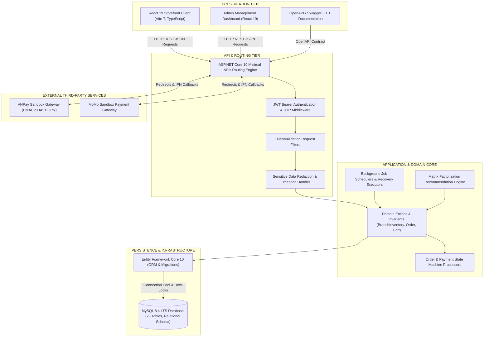
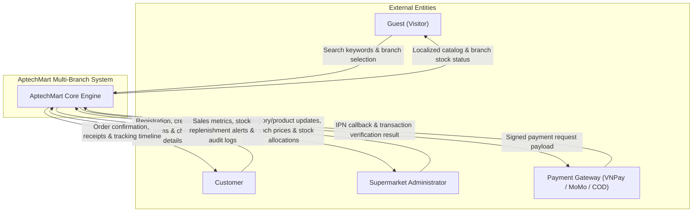
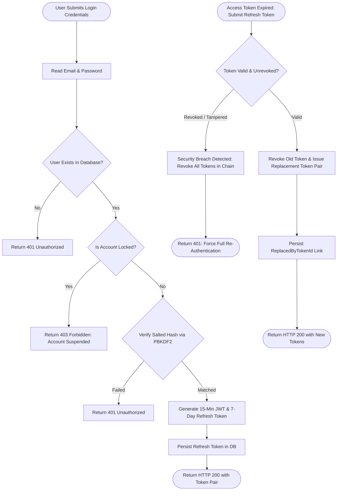
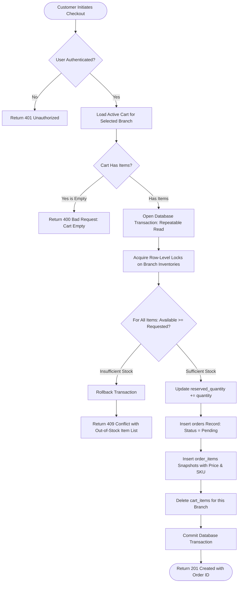
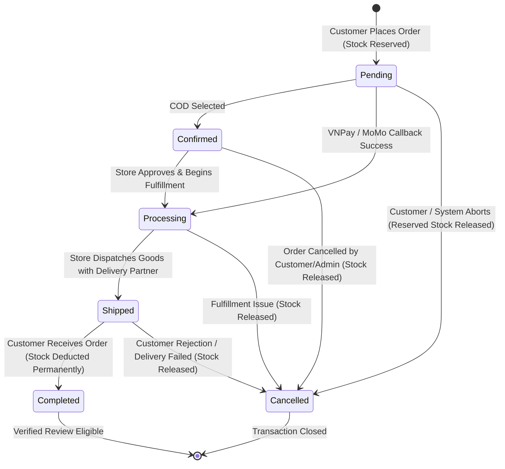
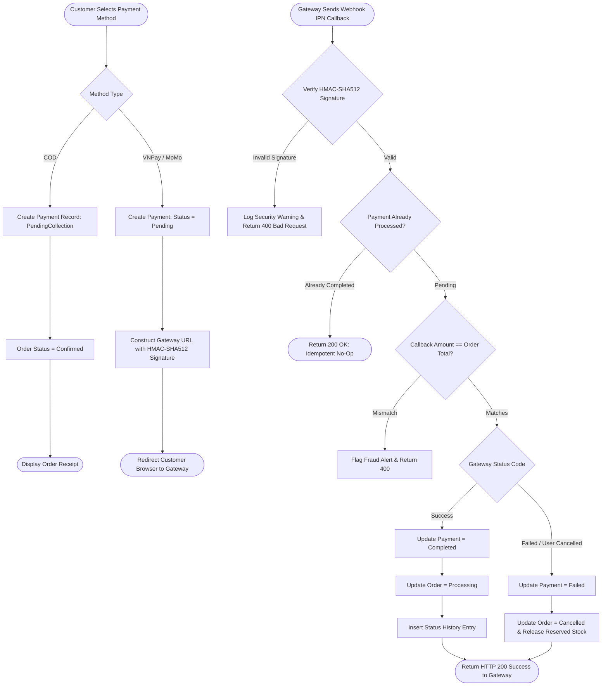
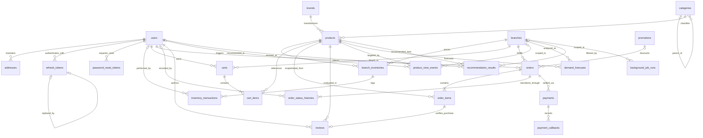

# CHAPTER 3: ePROJECT DESIGN

## 3.1. System Architecture Design

The AptechMart architecture strictly adheres to **Clean Architecture** and **Domain-Driven Design (DDD)** principles. This decoupled design guarantees high testability, maintainability, and domain rule isolation.

---

## 3.2. Data Flow Diagrams (DFDs)

### Context Level Diagram (System Boundary)
In this Context Diagram, all data flows are strictly labeled by the **transmitted business data payload**:

---

### Level 0 DFD (Subsystem Decomposition)

```mermaid
flowchart TD
    %% External Entities
    GUEST["Guest"]
    CUST["Customer"]
    ADMIN["Administrator"]
    GW["Payment Gateway"]

    %% Data Stores
    D1[("D1: categories, brands, products")]
    D2[("D2: users, refresh_tokens, addresses")]
    D3[("D3: branches, branch_inventories")]
    D4[("D4: carts, cart_items")]
    D5[("D5: orders, order_items, order_status_histories")]
    D6[("D6: payments, payment_callbacks")]
    D7[("D7: reviews")]
    D8[("D8: demand_forecasts, recommendation_results")]

    %% Processes
    P1["P.1 Browse Catalog & Search"]
    P2["P.2 Identity & Address Management"]
    P3["P.3 Shopping Cart Mutation"]
    P4["P.4 Transactional Checkout & Stock Reservation"]
    P5["P.5 Payment Processing & IPN Verification"]
    P6["P.6 Verified Reviews"]
    P7["P.7 Catalog & Product Administration"]
    P8["P.8 Branch Inventory & Pricing Allocation"]
    P9["P.9 Order Fulfillment Lifecycle"]
    P10["P.10 User Governance & Security"]
    P11["P.11 Sales & Analytics Reporting"]
    P12["P.12 Demand Forecast & Recommendation"]

    %% Flows
    GUEST -->|Search query & branch filter| P1
    P1 <-->|Read product details & branch stock| D1
    P1 <-->|Read localized stock| D3
    P1 -->|Product cards & pricing| GUEST

    CUST -->|Credentials & address updates| P2
    P2 <-->|User credentials, tokens & addresses| D2
    P2 -->|Profile state & token pairs| CUST

    CUST -->|Item selections & quantity changes| P3
    P3 <-->|Active cart lines| D4
    P3 <-->|Verify available stock| D3
    P3 -->|Cart subtotal & item counts| CUST

    CUST -->|Checkout confirmation & shipping address| P4
    P4 <-->|Cart contents| D4
    P4 -->|Acquire lock & reserve stock| D3
    P4 -->|Create order snapshot & status history| D5
    P4 -->|Clear cart| D4
    P4 -->|Order ID & payment redirect URL| CUST

    P4 -->|Payment initiation payload| P5
    P5 -->|Redirect payload| GW
    GW -->|Signed IPN callback payload| P5
    P5 <-->|Verify idempotency & record payment| D6
    P5 -->|Update order to Processing| D5

    CUST -->|Product rating & commentary| P6
    P6 <-->|Verify completed purchase| D5
    P6 -->|Save rating| D7

    ADMIN -->|Category, brand & product definitions| P7
    P7 -->|Persist catalog structure| D1

    ADMIN -->|Branch selling prices & replenished quantities| P8
    P8 -->|Update localized stock & prices| D3

    ADMIN -->|Order fulfillment status updates| P9
    P9 <-->|Read pending orders & advance status| D5
    P9 -->|Deduct on-hand & reserved stock upon completion| D3

    ADMIN -->|Lock user account & revoke access| P10
    P10 -->|Revoke refresh tokens| D2

    ADMIN -->|Report filter parameters| P11
    P11 <-->|Aggregate fulfilled order transactions| D5
    P11 -->|Sales performance charts & KPIs| ADMIN

    P12 <-->|Read sales velocity & branch stock| D3
    P12 <-->|Read order history| D5
    P12 -->|Generate restocking alerts & ML scores| D8
    P12 -->|Forecast summary| ADMIN
```

---

## 3.3. Business Process Flowcharts & State Machines

### Authentication & Token Rotation Flowchart

---

### Transactional Checkout & Stock Reservation Flowchart

---

### Order Lifecycle State Machine Diagram

---

### Payment Process & IPN Webhook Idempotency Flowchart

---

## 3.4. Database Design (ERD & Data Dictionary)

### Entity-Relationship Diagram (ERD - 23 Tables)

---

### Comprehensive Data Dictionary (All 23 Canonical Tables)

#### 1. `branches` (Physical Supermarket Locations)
| Column Name | Data Type | Nullable | Key / Constraint | Description |
| :--- | :--- | :---: | :--- | :--- |
| `id` | char(36) | NO | PK, UUID v7 | Unique physical branch identifier. |
| `name` | varchar(255) | NO | Non-empty | Physical branch commercial name (e.g. Cau Giay Branch). |
| `code` | varchar(50) | NO | UNIQUE | Unique short code for branch routing. |
| `address` | varchar(500) | NO | Non-empty | Physical street address of the supermarket store. |
| `phone_number`| varchar(20) | YES | Phone format | Direct customer support contact number. |
| `is_active` | tinyint(1) | NO | DEFAULT 1 | Operating status flag. |
| `created_at` | datetime(6) | NO | Timestamp | Branch registration date. |
| `updated_at` | datetime(6) | YES | Timestamp | Last record modification timestamp. |

#### 2. `categories` (Product Classification Hierarchy)
| Column Name | Data Type | Nullable | Key / Constraint | Description |
| :--- | :--- | :---: | :--- | :--- |
| `id` | char(36) | NO | PK, UUID v7 | Unique category identifier. |
| `parent_id` | char(36) | YES | FK -> `categories.id` | Self-referencing parent category pointer. |
| `name` | varchar(255) | NO | Non-empty | Category display name. |
| `slug` | varchar(255) | NO | UNIQUE, Index | SEO-friendly URL slug. |
| `description` | text | YES | | Category marketing description. |
| `display_order`| int | NO | DEFAULT 0 | Visual sort ordering weight. |
| `is_active` | tinyint(1) | NO | DEFAULT 1 | Active visibility toggle. |
| `created_at` | datetime(6) | NO | Timestamp | Category creation timestamp. |
| `updated_at` | datetime(6) | YES | Timestamp | Last update timestamp. |

#### 3. `brands` (Product Manufacturers)
| Column Name | Data Type | Nullable | Key / Constraint | Description |
| :--- | :--- | :---: | :--- | :--- |
| `id` | char(36) | NO | PK, UUID v7 | Unique brand identifier. |
| `name` | varchar(255) | NO | Non-empty | Brand corporate name (e.g. Samsung, LG). |
| `slug` | varchar(255) | NO | UNIQUE, Index | URL slug identifier. |
| `logo_url` | varchar(500) | YES | URL format | Brand logo graphic URL. |
| `is_active` | tinyint(1) | NO | DEFAULT 1 | Active brand status toggle. |
| `created_at` | datetime(6) | NO | Timestamp | Record creation timestamp. |
| `updated_at` | datetime(6) | YES | Timestamp | Modification timestamp. |

#### 4. `products` (Global Product Master Catalog)
| Column Name | Data Type | Nullable | Key / Constraint | Description |
| :--- | :--- | :---: | :--- | :--- |
| `id` | char(36) | NO | PK, UUID v7 | Unique product master identifier. |
| `category_id` | char(36) | NO | FK -> `categories.id` | Associated product category. |
| `brand_id` | char(36) | NO | FK -> `brands.id` | Associated manufacturer brand. |
| `name` | varchar(255) | NO | Index | Global product commercial name. |
| `slug` | varchar(255) | NO | UNIQUE, Index | Unique product URL slug. |
| `sku` | varchar(100) | NO | UNIQUE, Index | Global Stock Keeping Unit (SKU) barcode. |
| `unit` | varchar(50) | NO | Non-empty | Unit of measure (e.g. Piece, Box, Kg). |
| `description` | longtext | YES | | Comprehensive product description. |
| `specifications`| json | YES | Valid JSON | Key-value technical specifications table. |
| `image_urls` | json | YES | Valid JSON | Array of product image URLs. |
| `is_active` | tinyint(1) | NO | DEFAULT 1 | Global product active status. |
| `created_at` | datetime(6) | NO | Timestamp | Record creation timestamp. |
| `updated_at` | datetime(6) | YES | Timestamp | Modification timestamp. |

#### 5. `branch_inventories` (Localized Branch Pricing & Stock)
| Column Name | Data Type | Nullable | Key / Constraint | Description |
| :--- | :--- | :---: | :--- | :--- |
| `id` | char(36) | NO | PK, UUID v7 | Unique branch inventory record ID. |
| `branch_id` | char(36) | NO | FK -> `branches.id`, UQ1 | Supermarket branch location. |
| `product_id` | char(36) | NO | FK -> `products.id`, UQ1 | Stocked product master. |
| `selling_price`| decimal(18,2)| NO | CHECK >= 0 | Localized retail unit price at this branch. |
| `quantity_on_hand`| int | NO | CHECK >= 0, >= reserved | Physical units present in supermarket stockroom. |
| `reserved_quantity`| int | NO | CHECK >= 0 | Units locked for active pending checkouts. |
| `reorder_level`| int | NO | CHECK >= 0, DEFAULT 5 | Minimum threshold triggering replenishment alerts. |
| `created_at` | datetime(6) | NO | Timestamp | Inventory record initial date. |
| `updated_at` | datetime(6) | YES | Timestamp | Last stock or price update timestamp. |

*(Unique index `UQ_branch_inventories_branch_product` enforces one inventory record per branch-product pair).*

#### 6. `users` (Identity & User Accounts)
| Column Name | Data Type | Nullable | Key / Constraint | Description |
| :--- | :--- | :---: | :--- | :--- |
| `id` | char(36) | NO | PK, UUID v7 | Unique user identifier. |
| `email` | varchar(255) | NO | UNIQUE, Index | Unique authentication email address. |
| `password_hash`| varchar(500) | NO | PBKDF2 format | Cryptographically salted PBKDF2 password hash. |
| `full_name` | varchar(255) | NO | Non-empty | User legal name. |
| `phone_number`| varchar(20) | YES | | Contact telephone number. |
| `role` | varchar(50) | NO | DEFAULT 'Customer'| System role (`Customer` or `Admin`). |
| `is_locked` | tinyint(1) | NO | DEFAULT 0 | Administrative lockout toggle. |
| `created_at` | datetime(6) | NO | Timestamp | Account registration timestamp. |
| `updated_at` | datetime(6) | YES | Timestamp | Last profile update. |

#### 7. `addresses` (Customer Delivery Address Book)
| Column Name | Data Type | Nullable | Key / Constraint | Description |
| :--- | :--- | :---: | :--- | :--- |
| `id` | char(36) | NO | PK, UUID v7 | Unique shipping address record ID. |
| `user_id` | char(36) | NO | FK -> `users.id`, Index | Owning customer account. |
| `recipient_name`| varchar(255)| NO | Non-empty | Contact person at delivery destination. |
| `phone_number`| varchar(20) | NO | Non-empty | Delivery contact phone number. |
| `street` | varchar(500) | NO | Non-empty | House number and street name. |
| `ward` | varchar(100) | YES | | Ward or neighborhood jurisdiction. |
| `district` | varchar(100) | NO | Non-empty | Urban district name. |
| `city` | varchar(100) | NO | Non-empty | Province or municipality name. |
| `is_default` | tinyint(1) | NO | DEFAULT 0 | Flag designating primary shipping address. |
| `created_at` | datetime(6) | NO | Timestamp | Address creation date. |
| `updated_at` | datetime(6) | YES | Timestamp | Modification date. |

#### 8. `refresh_tokens` (JWT Refresh Token Rotation)
| Column Name | Data Type | Nullable | Key / Constraint | Description |
| :--- | :--- | :---: | :--- | :--- |
| `id` | char(36) | NO | PK, UUID v7 | Unique token record ID. |
| `user_id` | char(36) | NO | FK -> `users.id`, Index | Token holder account. |
| `token` | varchar(500) | NO | UNIQUE, Index | Cryptographic token string. |
| `expires_at` | datetime(6) | NO | Timestamp | Expiration deadline. |
| `is_revoked` | tinyint(1) | NO | DEFAULT 0 | Revocation status flag. |
| `replaced_by_token_id`| char(36)| YES | FK -> `refresh_tokens.id` | Descendant token reference in rotation chain. |
| `created_at` | datetime(6) | NO | Timestamp | Token issuance timestamp. |

#### 9. `password_reset_tokens` (Account Recovery)
| Column Name | Data Type | Nullable | Key / Constraint | Description |
| :--- | :--- | :---: | :--- | :--- |
| `id` | char(36) | NO | PK, UUID v7 | Unique reset token ID. |
| `user_id` | char(36) | NO | FK -> `users.id`, Index | Target user account. |
| `token` | varchar(500) | NO | UNIQUE | Single-use recovery token. |
| `expires_at` | datetime(6) | NO | Timestamp | Token expiration (usually 1 hour). |
| `is_used` | tinyint(1) | NO | DEFAULT 0 | Single-use redemption flag. |
| `created_at` | datetime(6) | NO | Timestamp | Issuance timestamp. |

#### 10. `carts` (Branch-Scoped Customer Carts)
| Column Name | Data Type | Nullable | Key / Constraint | Description |
| :--- | :--- | :---: | :--- | :--- |
| `id` | char(36) | NO | PK, UUID v7 | Unique cart identifier. |
| `user_id` | char(36) | NO | FK -> `users.id`, Index | Owning customer. |
| `branch_id` | char(36) | NO | FK -> `branches.id` | Physical supermarket branch fulfilling this cart. |
| `created_at` | datetime(6) | NO | Timestamp | Cart creation timestamp. |
| `updated_at` | datetime(6) | YES | Timestamp | Last cart mutation timestamp. |

#### 11. `cart_items` (Individual Cart Line Items)
| Column Name | Data Type | Nullable | Key / Constraint | Description |
| :--- | :--- | :---: | :--- | :--- |
| `id` | char(36) | NO | PK, UUID v7 | Unique cart line ID. |
| `cart_id` | char(36) | NO | FK -> `carts.id`, UQ1 | Owning cart. |
| `product_id` | char(36) | NO | FK -> `products.id`, UQ1 | Selected product. |
| `quantity` | int | NO | CHECK > 0 | Selected unit count. |
| `created_at` | datetime(6) | NO | Timestamp | Addition timestamp. |
| `updated_at` | datetime(6) | YES | Timestamp | Quantity update timestamp. |

#### 12. `promotions` (Discount Campaigns & Coupons)
| Column Name | Data Type | Nullable | Key / Constraint | Description |
| :--- | :--- | :---: | :--- | :--- |
| `id` | char(36) | NO | PK, UUID v7 | Unique promotion record ID. |
| `code` | varchar(50) | NO | UNIQUE, Index | Customer promotional coupon code (e.g. SALE10). |
| `description` | varchar(500) | YES | | Promotional terms and conditions description. |
| `discount_type`| varchar(20) | NO | 'Percentage'/'Fixed' | Discount calculation mechanism. |
| `discount_value`| decimal(18,2)| NO | CHECK > 0 | Discount rate percentage or currency amount. |
| `min_order_amount`| decimal(18,2)| NO | DEFAULT 0 | Minimum cart subtotal qualifying for promotion. |
| `max_discount_amount`| decimal(18,2)| YES | | Ceiling cap for percentage discounts. |
| `max_uses` | int | NO | CHECK > 0 | Total allowed redemptions across all users. |
| `times_used` | int | NO | DEFAULT 0 | Current completed redemptions count. |
| `start_date` | datetime(6) | NO | Timestamp | Campaign activation timestamp. |
| `end_date` | datetime(6) | NO | Timestamp | Campaign expiration timestamp. |
| `is_active` | tinyint(1) | NO | DEFAULT 1 | Manual promotion toggle. |
| `created_at` | datetime(6) | NO | Timestamp | Record creation timestamp. |
| `updated_at` | datetime(6) | YES | Timestamp | Record modification timestamp. |

#### 13. `orders` (Fulfilled and Pending Retail Orders)
| Column Name | Data Type | Nullable | Key / Constraint | Description |
| :--- | :--- | :---: | :--- | :--- |
| `id` | char(36) | NO | PK, UUID v7 | Unique order identifier. |
| `order_number` | varchar(50) | NO | UNIQUE, Index | Human-readable tracking number (e.g. ORD-2026-0001).|
| `user_id` | char(36) | NO | FK -> `users.id`, Index | Customer placing the order. |
| `branch_id` | char(36) | NO | FK -> `branches.id` | Supermarket branch fulfilling and packing goods. |
| `promotion_id` | char(36) | YES | FK -> `promotions.id` | Applied discount campaign (if any). |
| `fulfillment_mode`| varchar(20)| NO | 'Delivery'/'Pickup' | Shipping mode selected by customer. |
| `status` | varchar(30) | NO | Index | State (`Pending`,`Confirmed`,`Processing`,`Shipped`,`Completed`,`Cancelled`). |
| `subtotal` | decimal(18,2)| NO | CHECK >= 0 | Raw item total before discounts and fees. |
| `discount_amount`| decimal(18,2)| NO | DEFAULT 0 | Total discount applied from promotion. |
| `shipping_fee` | decimal(18,2)| NO | DEFAULT 0 | Expedited logistics delivery fee. |
| `total_amount` | decimal(18,2)| NO | CHECK >= 0 | Final grand total payable (`subtotal - discount + fee`).|
| `shipping_address`| json | YES | Valid JSON | Immutable snapshot of recipient shipping coordinates.|
| `notes` | text | YES | | Special delivery instructions from customer. |
| `created_at` | datetime(6) | NO | Timestamp, Index | Order placement timestamp. |
| `updated_at` | datetime(6) | YES | Timestamp | Last state transition timestamp. |

#### 14. `order_items` (Immutable Order Line Snapshots)
| Column Name | Data Type | Nullable | Key / Constraint | Description |
| :--- | :--- | :---: | :--- | :--- |
| `id` | char(36) | NO | PK, UUID v7 | Unique line item identifier. |
| `order_id` | char(36) | NO | FK -> `orders.id`, Index | Associated parent order. |
| `product_id` | char(36) | NO | FK -> `products.id` | Master product reference. |
| `product_name` | varchar(255)| NO | Non-empty | Snapshot of product title at time of purchase. |
| `sku` | varchar(100) | NO | Non-empty | Snapshot of SKU barcode. |
| `unit_price` | decimal(18,2)| NO | CHECK >= 0 | Snapshot of locked unit selling price. |
| `quantity` | int | NO | CHECK > 0 | Number of units purchased. |
| `total_price` | decimal(18,2)| NO | CHECK >= 0 | Line total (`unit_price * quantity`). |
| `created_at` | datetime(6) | NO | Timestamp | Line creation timestamp. |

#### 15. `order_status_histories` (Order Audit Trail)
| Column Name | Data Type | Nullable | Key / Constraint | Description |
| :--- | :--- | :---: | :--- | :--- |
| `id` | char(36) | NO | PK, UUID v7 | Unique status log record ID. |
| `order_id` | char(36) | NO | FK -> `orders.id`, Index | Associated order. |
| `changed_by_user_id`| char(36)| YES | FK -> `users.id` | User or Admin triggering transition. |
| `from_status` | varchar(30) | YES | | Preceding order state. |
| `to_status` | varchar(30) | NO | Non-empty | Consequent order state. |
| `reason` | text | YES | | Context or explanation for status update. |
| `created_at` | datetime(6) | NO | Timestamp | Transition timestamp. |

#### 16. `payments` (Payment Records & Transactions)
| Column Name | Data Type | Nullable | Key / Constraint | Description |
| :--- | :--- | :---: | :--- | :--- |
| `id` | char(36) | NO | PK, UUID v7 | Unique payment transaction ID. |
| `order_id` | char(36) | NO | FK -> `orders.id`, Index | Associated order. |
| `payment_method`| varchar(50) | NO | 'COD'/'VNPay'/'MoMo' | Chosen payment rail. |
| `status` | varchar(30) | NO | Index | State (`Pending`,`Completed`,`Failed`,`Refunded`). |
| `amount` | decimal(18,2)| NO | CHECK >= 0 | Transaction monetary amount. |
| `transaction_id`| varchar(255)| YES | Index | External gateway transaction reference code. |
| `gateway_response`| text | YES | | Serialized payload response from gateway. |
| `created_at` | datetime(6) | NO | Timestamp | Payment initiation timestamp. |
| `updated_at` | datetime(6) | YES | Timestamp | Payment completion or failure timestamp. |

#### 17. `payment_callbacks` (Idempotent Webhook Log)
| Column Name | Data Type | Nullable | Key / Constraint | Description |
| :--- | :--- | :---: | :--- | :--- |
| `id` | char(36) | NO | PK, UUID v7 | Unique callback event ID. |
| `payment_id` | char(36) | NO | FK -> `payments.id` | Associated payment record. |
| `idempotency_key`| varchar(255)| NO | UNIQUE, Index | Unique signature hash preventing duplicate processing.|
| `raw_payload` | longtext | NO | Valid JSON/Form | Raw incoming request payload from gateway IPN. |
| `is_verified` | tinyint(1) | NO | DEFAULT 0 | Checksum signature verification outcome flag. |
| `created_at` | datetime(6) | NO | Timestamp | Webhook arrival timestamp. |

#### 18. `inventory_transactions` (Stock Movement Ledger)
| Column Name | Data Type | Nullable | Key / Constraint | Description |
| :--- | :--- | :---: | :--- | :--- |
| `id` | char(36) | NO | PK, UUID v7 | Unique inventory ledger event ID. |
| `branch_inventory_id`| char(36)| NO | FK -> `branch_inventories.id` | Targeted branch inventory record. |
| `user_id` | char(36) | YES | FK -> `users.id` | Operator performing stock movement. |
| `transaction_type`| varchar(50)| NO | Index | Type (`Reserve`,`Sale`,`CancelRelease`,`Restock`). |
| `quantity_delta`| int | NO | Non-zero | Stock movement magnitude (+/-). |
| `balance_after` | int | NO | CHECK >= 0 | Resulting stock on hand after transaction. |
| `operation_key`| varchar(255)| NO | UNIQUE, Index | Concurrency key preventing duplicate ledger entries. |
| `created_at` | datetime(6) | NO | Timestamp | Ledger recording timestamp. |

#### 19. `reviews` (Verified Customer Product Feedback)
| Column Name | Data Type | Nullable | Key / Constraint | Description |
| :--- | :--- | :---: | :--- | :--- |
| `id` | char(36) | NO | PK, UUID v7 | Unique review identifier. |
| `product_id` | char(36) | NO | FK -> `products.id`, Index | Reviewed product master. |
| `user_id` | char(36) | NO | FK -> `users.id`, Index | Customer submitting review. |
| `order_item_id`| char(36) | NO | FK -> `order_items.id`, UQ1 | Verified completed order line reference. |
| `rating` | int | NO | CHECK (1 <= rating <= 5) | Customer evaluation score (1 to 5 stars). |
| `comment` | text | YES | | Textual review and customer feedback. |
| `is_approved` | tinyint(1) | NO | DEFAULT 1 | Content moderation flag. |
| `created_at` | datetime(6) | NO | Timestamp | Review publication timestamp. |
| `updated_at` | datetime(6) | YES | Timestamp | Last edit timestamp. |

#### 20. `product_view_events` (Clickstream & Analytics Events)
| Column Name | Data Type | Nullable | Key / Constraint | Description |
| :--- | :--- | :---: | :--- | :--- |
| `id` | char(36) | NO | PK, UUID v7 | Unique interaction event ID. |
| `product_id` | char(36) | NO | FK -> `products.id`, Index | Viewed product master. |
| `user_id` | char(36) | YES | FK -> `users.id`, Index | Customer viewing item (null if guest). |
| `branch_id` | char(36) | YES | FK -> `branches.id` | Supermarket branch selected during view. |
| `session_id` | varchar(100) | NO | Index | Browser session correlation key. |
| `viewed_at` | datetime(6) | NO | Timestamp | Exact event timestamp. |

#### 21. `demand_forecasts` (Inventory Demand Forecasting)
| Column Name | Data Type | Nullable | Key / Constraint | Description |
| :--- | :--- | :---: | :--- | :--- |
| `id` | char(36) | NO | PK, UUID v7 | Unique forecast calculation ID. |
| `product_id` | char(36) | NO | FK -> `products.id`, UQ1 | Targeted product. |
| `branch_id` | char(36) | NO | FK -> `branches.id`, UQ1 | Target supermarket branch. |
| `forecast_date`| date | NO | UQ1 | Forecast projection target date. |
| `forecast_quantity`| decimal(18,2)| NO | CHECK >= 0 | Projected units demanded. |
| `confidence_level`| decimal(5,2)| NO | CHECK (0 <= conf <= 1) | Statistical model confidence score. |
| `generated_at` | datetime(6) | NO | Timestamp | Forecast model execution timestamp. |

#### 22. `recommendation_results` (Collaborative Filtering AI)
| Column Name | Data Type | Nullable | Key / Constraint | Description |
| :--- | :--- | :---: | :--- | :--- |
| `id` | char(36) | NO | PK, UUID v7 | Unique recommendation record ID. |
| `user_id` | char(36) | NO | FK -> `users.id`, UQ1 | Target customer receiving recommendation. |
| `product_id` | char(36) | NO | FK -> `products.id`, UQ1 | Recommended product item. |
| `branch_id` | char(36) | YES | FK -> `branches.id` | Filtered supermarket branch scope. |
| `score` | decimal(10,4)| NO | Finite | Predicted Matrix Factorization affinity score. |
| `generated_at` | datetime(6) | NO | Timestamp | Model batch generation timestamp. |

#### 23. `background_job_runs` (Job Scheduling & Concurrency Leases)
| Column Name | Data Type | Nullable | Key / Constraint | Description |
| :--- | :--- | :---: | :--- | :--- |
| `id` | char(36) | NO | PK, UUID v7 | Unique background execution run ID. |
| `job_name` | varchar(100) | NO | Index | Job identifier (e.g. DemandForecastJob, MLTrainJob).|
| `branch_id` | char(36) | YES | FK -> `branches.id` | Physical branch scope (null if global). |
| `status` | varchar(30) | NO | Index | State (`Queued`,`Running`,`Succeeded`,`Failed`). |
| `lease_token` | varchar(100) | YES | Concurrency guard | Distributed lease token preventing dual execution. |
| `lease_expires_at`| datetime(6)| YES | Timestamp | Concurrency lease expiration deadline. |
| `error_summary`| text | YES | Sanitized | Sanitized error diagnostic summary (secrets redacted).|
| `started_at` | datetime(6) | YES | Timestamp | Execution start timestamp. |
| `completed_at` | datetime(6) | YES | Timestamp | Final terminal state timestamp. |
