# Thiết Kế Cơ Sở Dữ Liệu & ERD Hệ Thống AptechMart

Ngày cập nhật: 2026-09-08  
Trạng thái: **OFFICIAL (Canonical) — RELEASE READY (Gate A & Gate B Verified)**  
Phạm vi: **23 Bảng Vật Lý** đã triển khai và kiểm chứng 100% qua EF Core Migrations trên MySQL 8.4 LTS.

---

## 1. Phạm Vi Mô Hình & Phân Hệ

Mô hình dữ liệu của hệ thống AptechMart (Siêu thị điện tử trực tuyến đa chi nhánh) bao gồm 23 bảng vật lý chia thành 6 phân hệ cốt lõi:

1. **Tài khoản, Xác thực & Định danh (Identity & Security)**:
   - `users`: Thông tin tài khoản người dùng, phân quyền RBAC (`Customer`, `Admin`), trạng thái (`Active`, `Locked`, `Disabled`).
   - `refresh_tokens`: Token làm mới JWT xoay vòng (Rotation), băm SHA-256, phát hiện tái sử dụng token (`replaced_by_token_id`).
   - `password_reset_tokens`: Token đặt lại mật khẩu an toàn dùng một lần (`is_used`).
   - `addresses`: Sổ địa chỉ giao hàng của khách hàng, cờ địa chỉ mặc định `is_default` transactional.

2. **Danh mục Sản phẩm & Đa chi nhánh (Catalog Core & Multi-Branch)**:
   - `branches`: Danh sách siêu thị/chi nhánh vật lý (tọa độ GPS, địa chỉ, hotline, trạng thái hoạt động).
   - `categories`: Cây danh mục sản phẩm đa cấp hỗ trợ quan hệ cha-con (`parent_category_id`). Ràng buộc gán sản phẩm vào danh mục lá.
   - `brands`: Thương hiệu sản phẩm, slug URL chuẩn hóa.
   - `products`: Thông tin sản phẩm dùng chung toàn hệ thống (SKU duy nhất, tên, slug, giá cơ sở `base_price`, đơn vị tính, ảnh).

3. **Tồn kho Chi nhánh & Sổ cái Biến động (Inventory & Immutable Ledger)**:
   - `branch_inventories`: Tồn kho và giá bán độc lập tại từng chi nhánh (`selling_price`, `quantity_on_hand`, `reserved_quantity`, `reorder_level`).
   - `inventory_transactions`: Sổ cái giao dịch kho bất biến (Immutable Audit Ledger), ghi vết mọi biến động đặt hàng, hủy đơn, nhập kho, kiểm kê với khóa thao tác bất biến `operation_key`.

4. **Giỏ hàng, Đơn hàng, Thanh toán & Khuyến mãi (Shopping, Checkout, Payments & Promotions)**:
   - `carts`: Giỏ hàng của người dùng gắn với chi nhánh mua sắm đang chọn.
   - `cart_items`: Chi tiết các mặt hàng trong giỏ, liên kết tồn kho chi nhánh để kiểm tra tức thì.
   - `promotions`: Chương trình khuyến mãi và mã coupon (giảm theo % hoặc số tiền cố định, giá trị đơn tối thiểu, giới hạn sử dụng).
   - `orders`: Đơn hàng (mã đơn, chi nhánh fulfillment, hình thức Pickup/Delivery, snapshot địa chỉ giao hàng, tổng tiền, mã coupon, trạng thái).
   - `order_items`: Chi tiết sản phẩm trong đơn, snapshot tên sản phẩm và SKU tại thời điểm giao dịch.
   - `order_status_histories`: Lịch sử máy trạng thái đơn hàng (`Pending` -> `Confirmed` -> `Preparing` -> `Shipping` -> `Completed` / `Cancelled`).
   - `payments`: Bản ghi thanh toán theo đơn hàng (COD, VNPay, MoMo, trạng thái, mã giao dịch cổng).
   - `payment_callbacks`: Bản ghi webhook/IPN từ cổng thanh toán, bảo đảm tính Idempotency và kiểm tra chữ ký số HMAC.

5. **Phản hồi Khách hàng & Đánh giá Xác thực (Customer Feedback & Verified Reviews)**:
   - `reviews`: Đánh giá (Rating 1–5 sao và bình luận). Ràng buộc bảo đảm khách hàng chỉ đánh giá các sản phẩm đã nhận hàng thành công qua `order_item_id` (Verified Purchase).

6. **Trí tuệ Nhân tạo, Tác vụ Nền & Dự báo Nhu cầu (Intelligence, Background Jobs & Forecasting)**:
   - `product_view_events`: Sự kiện khách hàng xem sản phẩm, hỗ trợ thu thập cả người dùng ẩn danh (`anonymous_session_id`) và người dùng đã đăng nhập (`user_id`), phục vụ cơ chế Session Merge.
   - `background_job_runs`: Quản lý vòng đời các tác vụ nền định kỳ hoặc thủ công (huấn luyện AI, tính toán dự báo), có lease lock chống xung đột.
   - `recommendation_results`: Bảng chứa kết quả gợi ý sản phẩm đã được tính toán sẵn từ mô hình ML.NET Matrix Factorization (`mf-v1`) hoặc Content-based Fallback (`content-v1`), phân theo các phạm vi `User`, `Global`, `SimilarProduct`.
   - `demand_forecasts`: Kết quả dự báo nhu cầu tiêu thụ sản phẩm tại chi nhánh cho chu kỳ 7 ngày và 14 ngày (`horizon_days IN (7, 14)`).

> **Ghi chú về `stock_alerts`**: Theo quyết định kiến trúc tại Sprint 7 và kiểm chứng tại `MySqlSchemaTests.Migrations_DoNotCreateDeferredStockAlertsTable`, hệ thống **không tạo bảng vật lý riêng `stock_alerts`** trong CSDL. Cảnh báo thiếu hàng được truy vấn và tính toán động dựa trên chênh lệch giữa `demand_forecasts` và `branch_inventories.quantity_on_hand` để bảo đảm dữ liệu luôn tức thời, tránh dư thừa và sai lệch bảng lưu trữ.

---

## 2. Sơ Đồ ERD Tổng Thể (Mermaid)

```mermaid
erDiagram
    USERS ||--o{ ADDRESSES : owns
    USERS ||--o{ REFRESH_TOKENS : authenticates_with
    USERS ||--o{ PASSWORD_RESET_TOKENS : requests_reset
    REFRESH_TOKENS o|--o| REFRESH_TOKENS : replaced_by

    CATEGORIES o|--o{ CATEGORIES : parent_of
    CATEGORIES ||--o{ PRODUCTS : classifies
    BRANDS ||--o{ PRODUCTS : brands
    BRANCHES ||--o{ BRANCH_INVENTORIES : stocks
    PRODUCTS ||--o{ BRANCH_INVENTORIES : stocked_at
    BRANCH_INVENTORIES ||--o{ INVENTORY_TRANSACTIONS : records
    USERS o|--o{ INVENTORY_TRANSACTIONS : performed_by

    USERS ||--o{ CARTS : owns
    BRANCHES ||--o{ CARTS : selected_for
    CARTS ||--o{ CART_ITEMS : contains
    PRODUCTS ||--o{ CART_ITEMS : added_as
    BRANCH_INVENTORIES ||--o{ CART_ITEMS : verifies_stock

    USERS ||--o{ ORDERS : places
    BRANCHES ||--o{ ORDERS : fulfills
    PROMOTIONS o|--o{ ORDERS : applies_to
    ORDERS ||--|{ ORDER_ITEMS : contains
    PRODUCTS ||--o{ ORDER_ITEMS : snapshotted_as
    ORDERS ||--|{ ORDER_STATUS_HISTORIES : changes_through
    USERS o|--o{ ORDER_STATUS_HISTORIES : changed_by
    ORDERS ||--o{ PAYMENTS : paid_by
    PAYMENTS o|--o{ PAYMENT_CALLBACKS : receives

    USERS ||--o{ REVIEWS : writes
    PRODUCTS ||--o{ REVIEWS : evaluates
    ORDER_ITEMS ||--o| REVIEWS : verifies_purchase

    USERS o|--o{ PRODUCT_VIEW_EVENTS : generates
    BRANCHES o|--o{ PRODUCT_VIEW_EVENTS : viewed_at
    PRODUCTS ||--o{ PRODUCT_VIEW_EVENTS : viewed

    BACKGROUND_JOB_RUNS ||--o{ RECOMMENDATION_RESULTS : generates
    USERS o|--o{ RECOMMENDATION_RESULTS : personalized_for
    PRODUCTS ||--o{ RECOMMENDATION_RESULTS : recommends
    PRODUCTS o|--o{ RECOMMENDATION_RESULTS : similar_to

    BACKGROUND_JOB_RUNS ||--o{ DEMAND_FORECASTS : generates
    BRANCH_INVENTORIES ||--o{ DEMAND_FORECASTS : forecasts_stock

    USERS {
        char36 id PK
        varchar255 email UK
        varchar500 password_hash
        varchar150 full_name
        varchar20 phone
        varchar20 role
        varchar20 status
        datetime created_at_utc
        datetime updated_at_utc
    }

    REFRESH_TOKENS {
        char36 id PK
        char36 user_id FK
        varchar128 token_hash UK
        datetime expires_at_utc
        datetime revoked_at_utc
        char36 replaced_by_token_id FK
        datetime created_at_utc
    }

    PASSWORD_RESET_TOKENS {
        char36 id PK
        char36 user_id FK
        varchar128 token_hash UK
        datetime expires_at_utc
        datetime created_at_utc
        boolean is_used
    }

    ADDRESSES {
        char36 id PK
        char36 user_id FK
        varchar150 recipient_name
        varchar20 phone
        varchar500 street
        varchar100 ward
        varchar100 district
        varchar100 city
        varchar20 postal_code
        boolean is_default
        datetime created_at_utc
        datetime updated_at_utc
    }

    BRANCHES {
        char36 id PK
        varchar150 name
        varchar300 address
        varchar20 phone
        decimal latitude
        decimal longitude
        boolean is_active
        datetime created_at_utc
        datetime updated_at_utc
    }

    CATEGORIES {
        char36 id PK
        char36 parent_category_id FK
        varchar120 name
        varchar140 slug UK
        boolean is_active
        datetime created_at_utc
        datetime updated_at_utc
    }

    BRANDS {
        char36 id PK
        varchar120 name
        varchar140 slug UK
        boolean is_active
        datetime created_at_utc
        datetime updated_at_utc
    }

    PRODUCTS {
        char36 id PK
        char36 category_id FK
        char36 brand_id FK
        varchar64 sku UK
        varchar200 name
        varchar220 slug UK
        text description
        decimal base_price
        varchar30 unit
        varchar500 image_url
        boolean is_active
        datetime created_at_utc
        datetime updated_at_utc
    }

    BRANCH_INVENTORIES {
        char36 id PK
        char36 branch_id FK
        char36 product_id FK
        decimal selling_price
        int quantity_on_hand
        int reserved_quantity
        int reorder_level
        datetime updated_at_utc
    }

    INVENTORY_TRANSACTIONS {
        char36 id PK
        char36 branch_inventory_id FK
        varchar30 transaction_type
        int quantity_on_hand_delta
        int reserved_quantity_delta
        int quantity_on_hand_after
        int reserved_quantity_after
        varchar30 reference_type
        char36 reference_id
        varchar180 operation_key UK
        char36 actor_user_id FK
        varchar500 note
        datetime created_at_utc
    }

    CARTS {
        char36 id PK
        char36 user_id FK
        char36 branch_id FK
        datetime created_at_utc
        datetime updated_at_utc
    }

    CART_ITEMS {
        char36 id PK
        char36 cart_id FK
        char36 product_id FK
        char36 branch_inventory_id FK
        decimal unit_price
        int quantity
        datetime created_at_utc
        datetime updated_at_utc
    }

    PROMOTIONS {
        char36 id PK
        varchar50 code UK
        varchar20 discount_type
        decimal discount_value
        decimal min_order_amount
        int usage_limit
        int usage_count
        boolean is_active
        datetime created_at_utc
        datetime updated_at_utc
    }

    ORDERS {
        char36 id PK
        char36 user_id FK
        char36 branch_id FK
        varchar20 fulfillment_type
        char36 delivery_address_id FK
        varchar100 recipient_name
        varchar20 recipient_phone
        text delivery_address_snapshot
        decimal subtotal
        decimal discount_amount
        decimal shipping_fee
        decimal total_amount
        char36 promotion_id FK
        varchar50 promotion_code_snapshot
        varchar20 status
        datetime created_at_utc
        datetime updated_at_utc
    }

    ORDER_ITEMS {
        char36 id PK
        char36 order_id FK
        char36 product_id FK
        varchar200 product_name
        varchar50 sku
        decimal unit_price
        int quantity
        decimal line_total
    }

    ORDER_STATUS_HISTORIES {
        char36 id PK
        char36 order_id FK
        varchar30 from_status
        varchar30 to_status
        varchar500 note
        datetime created_at_utc
    }

    PAYMENTS {
        char36 id PK
        char36 order_id FK
        varchar30 method
        decimal amount
        varchar30 status
        varchar100 provider_transaction_id
        text raw_response
        datetime created_at_utc
        datetime updated_at_utc
    }

    PAYMENT_CALLBACKS {
        char36 id PK
        char36 payment_id FK
        varchar50 provider
        varchar128 external_event_id UK
        text payload_json
        boolean is_signature_valid
        decimal callback_amount
        varchar30 result_status
        datetime received_at_utc
    }

    REVIEWS {
        char36 id PK
        char36 user_id FK
        char36 order_item_id FK
        char36 product_id FK
        tinyint rating
        varchar2000 comment
        datetime created_at_utc
        datetime updated_at_utc
    }

    PRODUCT_VIEW_EVENTS {
        char36 id PK
        char36 product_id FK
        char36 user_id FK
        char36 anonymous_session_id
        char36 branch_id FK
        datetime viewed_at_utc
    }

    BACKGROUND_JOB_RUNS {
        char36 id PK
        varchar100 job_name
        varchar100 lock_key
        char36 branch_id FK
        varchar20 status
        varchar1000 error_summary
        varchar50 lock_token
        datetime lease_expires_at_utc
        datetime created_at_utc
        datetime started_at_utc
        datetime completed_at_utc
    }

    RECOMMENDATION_RESULTS {
        char36 id PK
        char36 job_run_id FK
        varchar30 scope
        varchar100 audience_key
        char36 user_id FK
        char36 source_product_id FK
        char36 recommended_product_id FK
        decimal score
        int rank
        varchar500 reason
        varchar50 algorithm_version
        datetime generated_at_utc
        datetime expires_at_utc
    }

    DEMAND_FORECASTS {
        char36 id PK
        char36 job_run_id FK
        char36 branch_inventory_id FK
        int horizon_days
        datetime forecast_start_date
        datetime forecast_end_date
        decimal predicted_quantity
        int actual_data_days
        varchar20 data_quality
        varchar50 algorithm_version
        datetime generated_at_utc
    }
```

---

## 3. Đặc Tả Chi Tiết 23 Bảng Vật Lý

### 3.1. Phân hệ Tài khoản & Xác thực (Identity & Security)

#### 1. `users`
- **Mục đích**: Quản lý tài khoản khách hàng và quản trị viên.
- **Khóa chính**: `id` (`char(36)`).
- **Chỉ mục**: `ix_users_email` (UNIQUE).
- **Trường chính**: `email`, `password_hash`, `full_name`, `phone`, `role` (`Customer`, `Admin`), `status` (`Active`, `Locked`, `Disabled`).

#### 2. `refresh_tokens`
- **Mục đích**: Lưu trữ mã làm mới JWT xoay vòng, hỗ trợ tự động hủy khi phát hiện tấn công tái sử dụng.
- **Khóa chính**: `id` (`char(36)`).
- **Khóa ngoại**: `user_id` -> `users(id)` (Cascade), `replaced_by_token_id` -> `refresh_tokens(id)`.
- **Chỉ mục**: `ix_refresh_tokens_token_hash` (UNIQUE).

#### 3. `password_reset_tokens`
- **Mục đích**: Quản lý mã OTP / Token đặt lại mật khẩu an toàn.
- **Khóa chính**: `id` (`char(36)`).
- **Khóa ngoại**: `user_id` -> `users(id)` (Cascade).
- **Chỉ mục**: `ix_password_reset_tokens_token_hash` (UNIQUE).

#### 4. `addresses`
- **Mục đích**: Sổ địa chỉ giao hàng của người dùng.
- **Khóa chính**: `id` (`char(36)`).
- **Khóa ngoại**: `user_id` -> `users(id)` (Cascade).
- **Trường chính**: `recipient_name`, `phone`, `street`, `ward`, `district`, `city`, `is_default`.

---

### 3.2. Phân hệ Danh mục & Đa Chi nhánh (Catalog & Multi-Branch)

#### 5. `branches`
- **Mục đích**: Danh sách siêu thị vật lý trực thuộc hệ thống AptechMart.
- **Khóa chính**: `id` (`char(36)`).
- **Trường chính**: `name`, `address`, `phone`, `latitude`, `longitude`, `is_active`.

#### 6. `categories`
- **Mục đích**: Cây danh mục sản phẩm (hỗ trợ đệ quy cha - con).
- **Khóa chính**: `id` (`char(36)`).
- **Khóa ngoại**: `parent_category_id` -> `categories(id)` (Restrict).
- **Chỉ mục**: `ix_categories_slug` (UNIQUE).

#### 7. `brands`
- **Mục đích**: Thương hiệu sản phẩm phân phối.
- **Khóa chính**: `id` (`char(36)`).
- **Chỉ mục**: `ix_brands_slug` (UNIQUE).

#### 8. `products`
- **Mục đích**: Dữ liệu sản phẩm cơ bản (toàn hệ thống dùng chung).
- **Khóa chính**: `id` (`char(36)`).
- **Khóa ngoại**: `category_id` -> `categories(id)`, `brand_id` -> `brands(id)`.
- **Chỉ mục**: `ix_products_sku` (UNIQUE), `ix_products_slug` (UNIQUE).

---

### 3.3. Phân hệ Tồn kho & Sổ cái Biến động (Inventory & Ledger)

#### 9. `branch_inventories`
- **Mục đích**: Quản lý tồn kho thực tế, tồn kho đã giữ và giá bán theo từng siêu thị.
- **Khóa chính**: `id` (`char(36)`).
- **Khóa ngoại**: `branch_id` -> `branches(id)`, `product_id` -> `products(id)`.
- **Chỉ mục**: UNIQUE(`branch_id`, `product_id`).
- **Trường tính toán**: `available_quantity` = `quantity_on_hand` - `reserved_quantity`.

#### 10. `inventory_transactions`
- **Mục đích**: Sổ cái giao dịch kho bất biến (Immutable Ledger) phục vụ kiểm toán tài chính và chống thất thoát.
- **Khóa chính**: `id` (`char(36)`).
- **Khóa ngoại**: `branch_inventory_id` -> `branch_inventories(id)`, `actor_user_id` -> `users(id)`.
- **Chỉ mục**: `ix_inventory_transactions_operation_key` (UNIQUE), `ix_inventory_transactions_inventory_created`.
- **Trường chính**: `transaction_type`, `quantity_on_hand_delta`, `reserved_quantity_delta`, `quantity_on_hand_after`, `reserved_quantity_after`, `operation_key`.

---

### 3.4. Phân hệ Giỏ hàng, Đơn hàng, Thanh toán & Khuyến mãi

#### 11. `carts`
- **Mục đích**: Giỏ hàng theo người dùng và chi nhánh đã chọn.
- **Khóa chính**: `id` (`char(36)`).
- **Khóa ngoại**: `user_id` -> `users(id)`, `branch_id` -> `branches(id)`.
- **Chỉ mục**: UNIQUE(`user_id`, `branch_id`).

#### 12. `cart_items`
- **Mục đích**: Các mục hàng trong giỏ.
- **Khóa chính**: `id` (`char(36)`).
- **Khóa ngoại**: `cart_id` -> `carts(id)` (Cascade), `product_id` -> `products(id)`, `branch_inventory_id` -> `branch_inventories(id)`.

#### 13. `promotions`
- **Mục đích**: Quản lý mã giảm giá và chiến dịch khuyến mãi.
- **Khóa chính**: `id` (`char(36)`).
- **Chỉ mục**: `ix_promotions_code` (UNIQUE).
- **Trường chính**: `code`, `discount_type` (`Percentage`, `FixedAmount`), `discount_value`, `min_order_amount`, `usage_limit`, `usage_count`, `is_active`.

#### 14. `orders`
- **Mục đích**: Bản ghi đơn hàng và hợp đồng giao dịch.
- **Khóa chính**: `id` (`char(36)`).
- **Khóa ngoại**: `user_id` -> `users(id)`, `branch_id` -> `branches(id)`, `delivery_address_id` -> `addresses(id)`, `promotion_id` -> `promotions(id)`.
- **Trường chính**: `fulfillment_type` (`Pickup`, `Delivery`), `delivery_address_snapshot`, `subtotal`, `discount_amount`, `shipping_fee`, `total_amount`, `status`.

#### 15. `order_items`
- **Mục đích**: Chi tiết các mặt hàng trong đơn, lưu snapshot bất biến.
- **Khóa chính**: `id` (`char(36)`).
- **Khóa ngoại**: `order_id` -> `orders(id)` (Cascade), `product_id` -> `products(id)`.
- **Trường chính**: `product_name`, `sku`, `unit_price`, `quantity`, `line_total`.

#### 16. `order_status_histories`
- **Mục đích**: Nhật ký kiểm toán lịch sử chuyển đổi trạng thái đơn hàng.
- **Khóa chính**: `id` (`char(36)`).
- **Khóa ngoại**: `order_id` -> `orders(id)` (Cascade).
- **Trường chính**: `from_status`, `to_status`, `note`, `created_at_utc`.

#### 17. `payments`
- **Mục đích**: Giao dịch thanh toán liên kết với đơn hàng.
- **Khóa chính**: `id` (`char(36)`).
- **Khóa ngoại**: `order_id` -> `orders(id)`.
- **Trường chính**: `method` (`COD`, `VNPay`, `MoMo`), `amount`, `status` (`Pending`, `Completed`, `Failed`), `provider_transaction_id`.

#### 18. `payment_callbacks`
- **Mục đích**: Nhật ký nhận Webhook/IPN callback từ các cổng thanh toán (chống trùng lặp Idempotency).
- **Khóa chính**: `id` (`char(36)`).
- **Khóa ngoại**: `payment_id` -> `payments(id)`.
- **Chỉ mục**: `ix_payment_callbacks_external_event_id` (UNIQUE).

---

### 3.5. Phân hệ Đánh giá Khách hàng (Customer Reviews)

#### 19. `reviews`
- **Mục đích**: Đánh giá và chấm điểm sản phẩm từ người dùng đã mua hàng.
- **Khóa chính**: `id` (`char(36)`).
- **Khóa ngoại**: `user_id` -> `users(id)`, `order_item_id` -> `order_items(id)`, `product_id` -> `products(id)`.
- **Chỉ mục**: `ix_reviews_order_item_id` (UNIQUE — bảo đảm mỗi sản phẩm trong đơn chỉ được đánh giá 1 lần).
- **Check constraint**: `ck_reviews_rating`: `rating >= 1 AND rating <= 5`.

---

### 3.6. Phân hệ Trí tuệ Nhân tạo & Dự báo (Intelligence & Jobs)

#### 20. `product_view_events`
- **Mục đích**: Ghi nhận hành vi xem sản phẩm của người dùng để làm tập tín hiệu huấn luyện mô hình gợi ý AI.
- **Khóa chính**: `id` (`char(36)`).
- **Khóa ngoại**: `product_id` -> `products(id)`, `user_id` -> `users(id)` (nullable), `branch_id` -> `branches(id)` (nullable).
- **Trường chính**: `anonymous_session_id`, `viewed_at_utc`.

#### 21. `background_job_runs`
- **Mục đích**: Bảng quản lý hạ tầng các tác vụ chạy nền định kỳ (huấn luyện model, tính toán forecast).
- **Khóa chính**: `id` (`char(36)`).
- **Chỉ mục**: UNIQUE(`job_name`, `lock_key`).
- **Trường chính**: `job_name`, `lock_key`, `status` (`Queued`, `Running`, `Succeeded`, `Failed`), `lock_token`, `lease_expires_at_utc`.

#### 22. `recommendation_results`
- **Mục đích**: Lưu trữ kết quả gợi ý sản phẩm đã được vật chất hóa (Materialized) từ mô hình ML.NET.
- **Khóa chính**: `id` (`char(36)`).
- **Khóa ngoại**: `job_run_id` -> `background_job_runs(id)`, `recommended_product_id` -> `products(id)`, `source_product_id` -> `products(id)` (nullable), `user_id` -> `users(id)` (nullable).
- **Chỉ mục**: `ix_recommendation_results_run_audience_product` (UNIQUE trên `job_run_id`, `audience_key`, `recommended_product_id`).
- **Check constraints**:
  - `ck_recommendation_results_rank`: `` `rank` > 0 ``
  - `ck_recommendation_results_score`: `score + 0 >= 0 AND score + 0 <= 1`
- **Trường chính**: `scope` (`User`, `Global`, `SimilarProduct`), `algorithm_version` (`mf-v1`, `content-v1`), `score`, `rank`, `reason`, `expires_at_utc`.

#### 23. `demand_forecasts`
- **Mục đích**: Lưu trữ kết quả dự báo nhu cầu tiêu thụ hàng hóa theo chi nhánh.
- **Khóa chính**: `id` (`char(36)`).
- **Khóa ngoại**: `job_run_id` -> `background_job_runs(id)`, `branch_inventory_id` -> `branch_inventories(id)`.
- **Chỉ mục**: `ix_demand_forecasts_run_inventory_horizon` (UNIQUE trên `job_run_id`, `branch_inventory_id`, `horizon_days`).
- **Check constraints**:
  - `ck_demand_forecasts_horizon`: `horizon_days IN (7, 14)`
  - `ck_demand_forecasts_predicted_quantity`: `predicted_quantity + 0 >= 0`
  - `ck_demand_forecasts_actual_data_days`: `actual_data_days + 0 >= 0 AND actual_data_days <= 28`
- **Trường chính**: `predicted_quantity`, `actual_data_days`, `data_quality`, `algorithm_version`.

---

## 4. Chuẩn Hóa Dữ Liệu & Ràng Buộc Kiến Trúc (3NF Compliance)

Mô hình dữ liệu của AptechMart tuân thủ đầy đủ **Chuẩn 3 (Third Normal Form - 3NF)** và các nguyên tắc thiết kế bất biến:
1. **1NF**: Toàn bộ các trường dữ liệu đều mang tính nguyên tử (Atomic). Mỗi bảng đều có Khóa chính (`CHAR(36)` UUID v4).
2. **2NF**: Toàn bộ các thuộc tính không khóa đều phụ thuộc hàm đầy đủ vào Khóa chính.
3. **3NF**: Không tồn tại bất kỳ phụ thuộc bắc cầu nào giữa các thuộc tính không khóa.
4. **Audit Snapshots Hợp Lệ**:
   - Các trường snapshot trong bảng `orders` và `order_items` (`product_name`, `sku`, `unit_price`, `delivery_address_snapshot`, `promotion_code_snapshot`) phản ánh **dữ liệu lịch sử có hiệu lực pháp lý bất biến** tại thời điểm giao kết hợp đồng mua bán, hoàn toàn không vi phạm nguyên tắc chuẩn hóa 3NF.
5. **Nguyên Tắc Bất Biến Sổ Cái (Ledger Invariant)**:
   - Mọi thay đổi về tồn kho trong `branch_inventories` đều được ghi sổ kép tại `inventory_transactions` với phương trình kiểm toán:  
     $$\text{quantity\_on\_hand\_after} = \text{quantity\_on\_hand\_before} + \text{quantity\_on\_hand\_delta}$$
